# 01 -- System Context (C4 Level 1)

> NeonDash Portal -- how the system fits into its environment.

## Context Diagram

```mermaid
C4Context
    title NeonDash Portal — System Context

    Person(mentor, "Mentor", "Manages mentorados, views performance metrics, uses AI agents")
    Person(mentorado, "Mentorado", "Tracks personal performance, interacts with AI, accesses CRM/financials")
    Person(clinicaStaff, "Clinica Staff", "Access restricted to assigned clinica workflows")
    Person(admin, "Admin", "Full system access, impersonation, mentorado management")

    System(neondash, "NeonDash Portal", "Fullstack mentorship performance dashboard. React 19 SPA + Hono API + tRPC + AI agents.")

    System_Ext(clerk, "Clerk", "Authentication and authorization (JWT, organizations, RBAC)")
    System_Ext(neonDb, "Neon PostgreSQL", "Serverless PostgreSQL primary database (3 connection contexts)")
    System_Ext(redis, "Redis", "Session cache + AI inter-agent pub/sub bus")
    System_Ext(gemini, "Google Gemini", "AI model provider (gemini-2.0-flash, 6 specialized agents)")
    System_Ext(meta, "Meta Platform", "WhatsApp Business API, Instagram Graph API, Facebook Marketing API")
    System_Ext(googleApis, "Google APIs", "Google Calendar, Google Sheets, Google Ads")
    System_Ext(resend, "Resend", "Transactional and marketing email delivery")
    System_Ext(stripe, "Stripe", "Subscription billing, webhook events")
    System_Ext(asaas, "ASAAS", "Brazilian payment gateway (billing sync)")
    System_Ext(hubla, "Hubla", "Course/subscription platform webhooks")
    System_Ext(kiwify, "Kiwify", "Course platform integration")
    System_Ext(awsS3, "AWS S3", "File and image storage")
    System_Ext(nuvemFiscal, "Nuvem Fiscal", "Brazilian NFS-e electronic invoice emission")
    System_Ext(coolify, "Coolify (VPS)", "Self-hosted deployment platform on Vultr VPS")

    Rel(mentor, neondash, "Accesses via web browser", "HTTPS")
    Rel(mentorado, neondash, "Accesses via web browser", "HTTPS")
    Rel(clinicaStaff, neondash, "Accesses via web browser", "HTTPS")
    Rel(admin, neondash, "Accesses via web browser", "HTTPS")

    Rel(neondash, clerk, "Authenticates users, validates JWTs", "HTTPS")
    Rel(neondash, neonDb, "Reads/writes all application data", "WebSocket + HTTP")
    Rel(neondash, redis, "Session cache + AI pub/sub", "TCP")
    Rel(neondash, gemini, "AI agent inference requests", "HTTPS")
    Rel(neondash, meta, "WhatsApp messaging, Instagram sync, Facebook Ads", "HTTPS")
    Rel(neondash, googleApis, "Calendar/Sheets sync, Ads data", "HTTPS")
    Rel(neondash, resend, "Sends transactional and marketing emails", "HTTPS")
    Rel(neondash, stripe, "Billing events + webhook ingestion", "HTTPS")
    Rel(neondash, asaas, "Payment sync + webhook ingestion", "HTTPS")
    Rel(neondash, hubla, "Subscription webhook ingestion", "HTTPS")
    Rel(neondash, kiwify, "Course platform webhook ingestion", "HTTPS")
    Rel(neondash, awsS3, "Stores files and images", "HTTPS")
    Rel(neondash, nuvemFiscal, "Emits electronic invoices (NFS-e)", "HTTPS")
    Rel(coolify, neondash, "Deploys and monitors (health checks, Docker)", "HTTPS/Docker API")
```

## Stakeholders

### Mentor

The primary power user. Mentors manage their mentorados (mentees), track performance metrics month-over-month, review faturamento (revenue), use AI-powered agents for CRM/SDR/marketing/financial tasks, send WhatsApp messages, manage Instagram integration, and configure email campaigns. A mentor operates within a Clerk organization and sees data scoped to their mentorados.

### Mentorado

A mentee enrolled under a mentor. Mentorados track their own performance KPIs (metrics mensais), interact with AI agents (widget agent for self-service), access their patient/client CRM, view financial summaries, and receive notifications. Their data is scoped to their own records within the mentor's organization.

### Clinica Staff

Staff members of a clinical practice. They have access restricted to clinica-specific workflows (patient management, scheduling, document signing) within a dedicated database context (`DATABASE_URL_CLINICA`). They cannot access mentorship-specific features.

### Admin

Full system access including user management, impersonation, mentorado onboarding, system configuration, and monitoring dashboards. Admins are identified by email in the `ADMIN_EMAILS` environment variable and bypass certain access restrictions.

## System Responsibilities

NeonDash is responsible for:

- **Performance tracking** -- monthly metrics collection, ranking, badges, gamification for mentorados
- **CRM** -- lead management (Kanban), interactions, tasks, automation pipelines
- **Patient management** -- clinical records, medical info, procedures, treatment plans, photo galleries, consent/document signing
- **Financial management** -- transactions, invoicing (NFS-e), payment tracking, category management, insumos
- **AI agents** -- 6 specialized agents (SDR, Marketing, Patient, Financial, Severino/ops, Widget) with memory, inter-agent communication, and proactive heartbeat
- **Communication** -- WhatsApp (Cloud API + Baileys), Instagram DMs, email campaigns (Resend), in-app notifications
- **Integrations** -- Google Calendar/Sheets/Ads sync, Facebook Ads reporting, Stripe/ASAAS/Hubla/Kiwify payment processing
- **Authentication** -- delegated to Clerk with role-based access control (admin, mentor, mentorado, clinica_staff, clinica_owner)

NeonDash does **not** handle:

- Identity provider infrastructure (delegated to Clerk)
- Payment processing logic (delegated to Stripe/ASAAS)
- Email delivery infrastructure (delegated to Resend)
- AI model training or hosting (delegated to Google Gemini)
- DNS/SSL certificate management (delegated to Coolify/Traefik/Let's Encrypt)

## Trust Boundaries

| Boundary | Services | Trust Level |
|----------|----------|-------------|
| **Fully trusted (internal)** | Neon PostgreSQL, Redis | Direct data access. Credentials are environment-injected secrets. Network-level isolation (Docker bridge network for Redis; Neon's managed TLS for PostgreSQL). |
| **Trusted with verification** | Clerk | JWTs are validated on every request via middleware. Webhook payloads are verified with `CLERK_WEBHOOK_SECRET`. Session data is cached in Redis (1h TTL) to reduce API calls. |
| **Trusted with verification** | Stripe, ASAAS, Hubla, Resend | Webhook signatures are verified on ingestion. API calls use scoped secret keys. |
| **Trusted with verification** | Meta Platform | Webhook verify token validation. System user access tokens for WhatsApp Cloud API. OAuth tokens for Instagram (stored encrypted, checked for expiry). |
| **External, verified** | Google APIs | OAuth 2.0 tokens stored encrypted in the database. Token refresh handled automatically. Scoped to minimum required permissions. |
| **External, fire-and-forget** | AWS S3, Nuvem Fiscal | Presigned URLs for S3 uploads. API key authentication for Nuvem Fiscal. No incoming webhooks. |
| **Infrastructure** | Coolify (VPS) | Deployment platform with Docker API access. Health checks via `/health/live` and `/health/ready`. Traefik handles TLS termination and reverse proxy. |

---

## Related Decisions

- [ADR-003: Three-Provider WhatsApp Strategy](adr/003-multi-whatsapp-providers.md) — WhatsApp Business, Z-API, and Baileys appear as a single external dependency in this context
- [ADR-007: Redis Dual-Purpose](adr/007-redis-dual-purpose.md) — Redis is an external system in this context (session cache + AI pub/sub)
- [ADR-011: Clerk Authentication](adr/011-clerk-authentication.md) — Clerk is the external auth system used for all four user personas
- [ADR-012: Neon PostgreSQL](adr/012-neon-postgresql.md) — Neon is the primary external database system
- [ADR-020: Dual Payment Strategy](adr/020-dual-payment-strategy.md) — Stripe and ASAAS appear as external payment systems
- [ADR-021: Google Gemini](adr/021-gemini-ai-provider.md) — Google Gemini is the external AI inference provider
