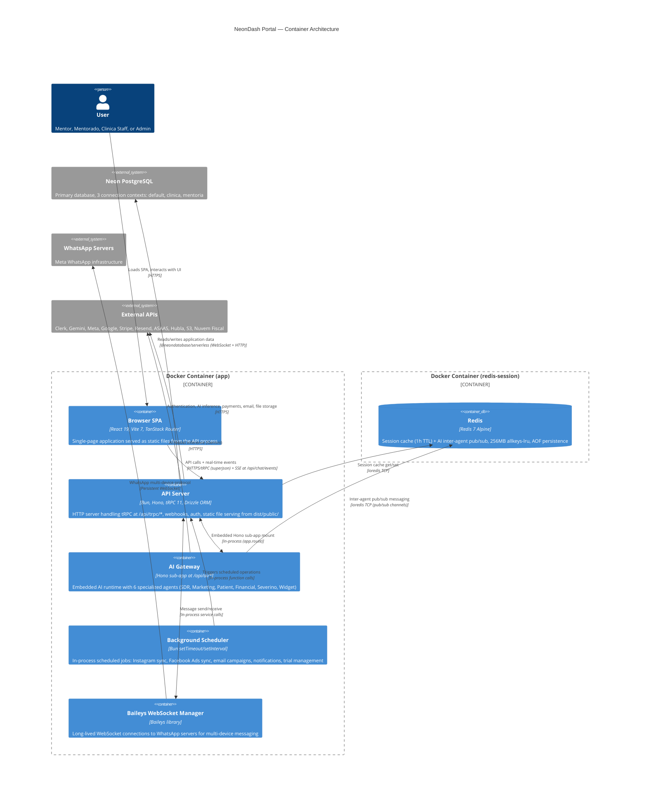

# 02 -- Container Architecture (C4 Level 2)

> Internal structure of the NeonDash system -- containers, communication protocols, and deployment model.

## Container Diagram

## Container Descriptions

### Browser SPA

The frontend is a React 19 single-page application built with Vite 7. It uses TanStack Router for file-based type-safe routing and communicates with the backend exclusively through tRPC (with superjson serialization) and a Server-Sent Events endpoint for real-time chat updates. The SPA is built at Docker image build time and served as static files from `dist/public/` by the API server process. There is no separate web server for the frontend.

Key frontend technologies: React 19, TanStack Router, TanStack Query, shadcn/ui, Tailwind CSS v4, Clerk React SDK, Recharts.

### API Server

The core backend process. A Hono HTTP server running on Bun that handles:

- **tRPC mount** at `/api/trpc/*` -- all typed API procedures (queries and mutations)
- **Static file serving** from `dist/public/` with SPA fallback for client-side routing
- **Webhook endpoints** for Stripe, ASAAS, Hubla, Clerk, Meta (WhatsApp/Instagram), Resend, and Baileys
- **Health probes** at `/health/live` (liveness) and `/health/ready` (readiness with DB + Redis checks)
- **Metrics** at `/metrics` (Prometheus-format process metrics)
- **Auth routes** for login/logout redirect and public config
- **OAuth callbacks** for Instagram, Facebook Ads, Google Calendar/Sheets/Ads
- **Public endpoints** for email unsubscribe and remote document signing

Middleware stack (order-sensitive): Hono logger, CORS, secure headers, Clerk auth, rate limiter.

### AI Gateway

An embedded Hono sub-application mounted at `/api/ai/*` within the API server process. It is **not** a separate service or container. The gateway manages 6 specialized AI agents (SDR, Marketing, Patient, Financial, Severino, Widget) that use Google Gemini for inference. Features include:

- Per-agent feature flags and rollout percentages
- Memory system (SQLite local + Neon PostgreSQL for search)
- Inter-agent communication via Redis pub/sub with typed envelopes, correlation IDs, and hop-count guards
- Proactive heartbeat jobs (agent-initiated check-ins)
- Nightly review jobs (automated agent summaries)
- Prometheus metrics at `/api/ai/metrics`

### Background Scheduler

An in-process scheduling module using Bun-native `setTimeout` and `setInterval`. There is no external job queue or cron service. Scheduled tasks include:

- Instagram sync for all mentorados (daily)
- Facebook Ads data sync (periodic)
- Email campaign sends (scheduled broadcasts)
- Lead automation step execution
- Trial expiry notifications and emails
- Session cache cleanup (every 5 minutes)

All timers are registered with `.unref()` to allow clean process shutdown.

### Baileys WebSocket Manager

A long-lived WebSocket connection manager for WhatsApp multi-device messaging via the Baileys library. Runs inside the API process and maintains persistent connections to WhatsApp servers. Session state is persisted to a Docker volume at `/app/.baileys-sessions`. Handles QR code authentication, reconnection logic, and message routing between WhatsApp and the NeonDash application layer.

### Redis (Sidecar)

A Redis 7 Alpine container running as a sidecar alongside the application container. Serves two purposes:

1. **Session cache** -- Clerk session data cached with 1-hour TTL to reduce authentication API calls by approximately 80%. The API server uses ioredis with an in-memory Map fallback when Redis is unavailable.
2. **AI inter-agent pub/sub** -- The AI Gateway uses Redis pub/sub channels for typed message passing between agents. Envelopes include correlation IDs for request-response patterns and hop counts to prevent infinite message loops.

Configuration: 256MB memory limit, `allkeys-lru` eviction policy, AOF persistence with `everysec` fsync.

### Neon PostgreSQL (External)

The primary data store. NeonDash connects to Neon PostgreSQL using `@neondatabase/serverless` which supports both WebSocket and HTTP transport. Three connection contexts exist:

| Context | Environment Variable | Purpose |
|---------|---------------------|---------|
| Default | `DATABASE_URL` | Primary application data (users, mentorados, metrics, CRM, financial) |
| Clinica | `DATABASE_URL_CLINICA` | Clinical practice data (patients, procedures, treatment plans) |
| Mentoria | `DATABASE_URL_MENTORIA` | Mentorship-specific data partition |

Schema is managed by Drizzle ORM with push-based migrations (`bun run db:push`).

## Deployment Model

NeonDash runs as a **single Bun process** inside a **single Docker container**, with Redis as a sidecar container. The Dockerfile uses a 3-stage multi-stage build:

| Stage | Base Image | Purpose |
|-------|-----------|---------|
| `deps` | `oven/bun:1.3.9-alpine` | Install production dependencies with frozen lockfile |
| `builder` | `oven/bun:1.3.9-alpine` | Install all dependencies, build web (Vite) and API (Bun bundler) |
| `runtime` | `oven/bun:1.3.9-alpine` | Copy build artifacts + prod deps, run as non-root `bunuser` |

The web SPA is built during the `builder` stage (Vite inlines `VITE_*` environment variables at compile time) and copied into `apps/api/dist/public/` in the runtime stage. The API server serves these static files directly -- there is no nginx or separate static file server.

## Port Layout

| Service | Internal Port | External Port | Notes |
|---------|--------------|---------------|-------|
| API Server | 3000 | `APP_PORT` (default 9999) | Mapped via Docker port binding or Traefik reverse proxy |
| Redis | 6379 | Not exposed | Only accessible on the `backend` Docker bridge network |

Traefik handles TLS termination, routes traffic to port 3000 on the app container, and provides security headers (X-Frame-Options, HSTS, X-Content-Type-Options, Referrer-Policy, Permissions-Policy). SSE responses are flushed immediately via `flushinterval=-1` on the Traefik load balancer.

## Resource Limits

| Container | CPU Limit | Memory Limit | CPU Reservation | Memory Reservation |
|-----------|-----------|-------------|-----------------|-------------------|
| `app` | 1.5 | 1536 MB | 0.75 | 512 MB |
| `redis-session` | 0.25 | 384 MB | 0.1 | 128 MB |

Health checks run every 30 seconds for the app container (HTTP GET to `/health/live`) and every 5 seconds for Redis (`redis-cli ping`).

---

## Related Decisions

- [ADR-001: Bun Runtime](adr/001-bun-runtime.md) — Bun is the runtime for both the API server and the background scheduler
- [ADR-002: Embedded AI Gateway](adr/002-embedded-ai-gateway.md) — AI Gateway is embedded as a Hono sub-app within the API container
- [ADR-003: Three-Provider WhatsApp](adr/003-multi-whatsapp-providers.md) — Baileys WebSocket manager runs within the single container
- [ADR-005: Single-Process Deployment](adr/005-single-process-deployment.md) — All containers run in a single Docker container (plus Redis sidecar)
- [ADR-007: Redis Dual-Purpose](adr/007-redis-dual-purpose.md) — Redis sidecar serves session cache + AI inter-agent pub/sub
- [ADR-010: tRPC](adr/010-trpc-over-rest.md) — API server exposes tRPC at /api/trpc/* with superjson serialization
- [ADR-019: SSE Real-Time](adr/019-sse-realtime.md) — SSE at /api/chat/events streams real-time updates to the SPA
