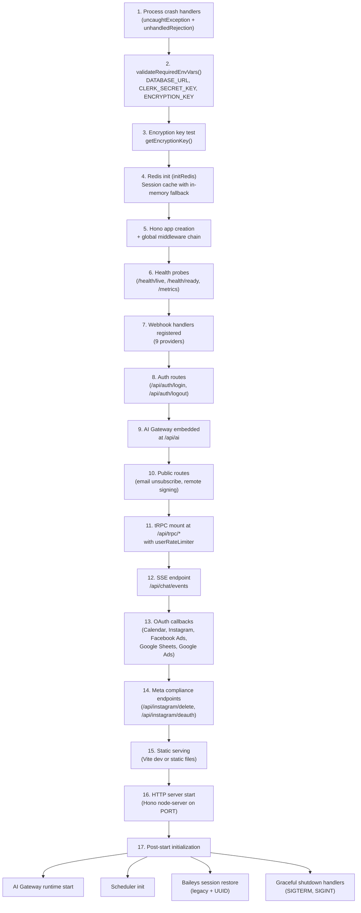
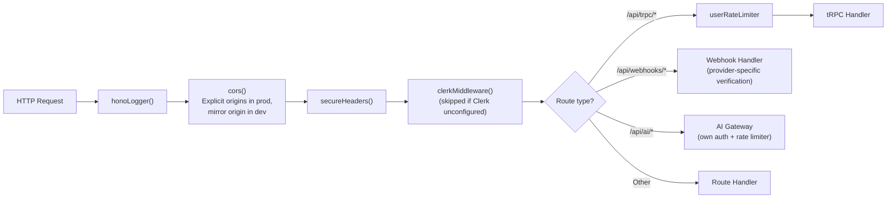
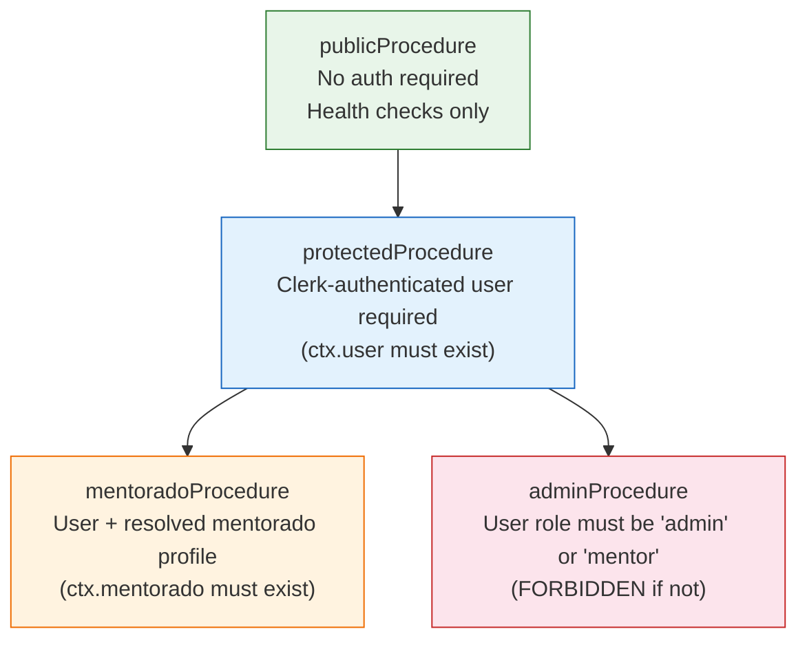
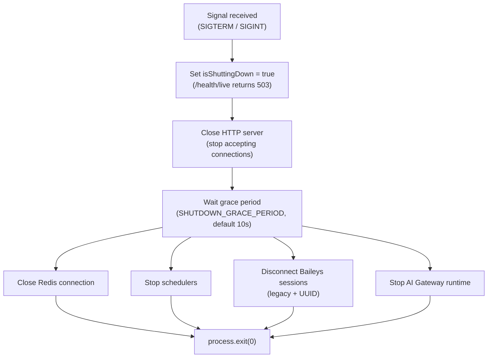

# C4 Level 3 -- Backend Components

> Internal component view of `apps/api/src/`. For the system context and container views, see [01-system-context.md](./01-system-context.md) and [02-container-architecture.md](./02-container-architecture.md).

---

## Server Boot Sequence

The entry point is `apps/api/src/_core/index.ts`. The `startServer()` function executes a strict 17-step initialization sequence. Any failure in steps 1--3 is fatal and terminates the process.

Steps 1--3 are **fatal on failure** (process exits). Step 4 (Redis) falls back to in-memory if Redis is unavailable. Steps 5--16 are synchronous registration. Step 17 runs fire-and-forget background initialization.

---

## Middleware Chain

Every inbound HTTP request passes through the global middleware stack in this exact order before reaching any route handler.

Key constraints enforced by middleware:
- **CORS**: Wildcard origin is blocked in production (Stability Rule G). Explicit `CORS_ORIGIN` env var required.
- **Clerk**: If publishable key or secret key are missing/invalid, Clerk middleware is disabled with a warning log.
- **Rate limiter**: Applied only to `/api/trpc/*` routes at the Hono level. AI Gateway has its own per-agent rate limiter.

---

## Procedure Hierarchy

tRPC procedures form a layered authorization chain defined in `apps/api/src/_core/trpc.ts`. Each level adds stricter context requirements.

| Procedure | Auth | Context Guarantee | Use Case |
|-----------|------|-------------------|----------|
| `publicProcedure` | None | `ctx` only | Health checks, system info |
| `protectedProcedure` | Clerk JWT | `ctx.user` non-null | Any authenticated operation |
| `mentoradoProcedure` | Clerk JWT + mentorado lookup | `ctx.user` + `ctx.mentorado` non-null | Mentorado-scoped data access |
| `adminProcedure` | Clerk JWT + role check | `ctx.user` with role `admin` or `mentor` | Admin panel operations |

---

## Router Map

56 tRPC routers registered in `apps/api/src/routers.ts`, grouped by business domain.

### CRM / Sales

| Router | Key | Source |
|--------|-----|--------|
| Leads | `leads` | `leads-router.ts` |
| Pipelines | `pipelines` | `pipelines-router.ts` |
| CRM Columns | `crmColumns` | `crm-columns-router.ts` |
| Interacoes | `interacoes` | `interacoes-router.ts` |
| Tags | `tags` | `tags-router.ts` |
| Objections | `objections` | `objections-router.ts` |
| Lead Meta | `leadMeta` | `lead-meta-router.ts` |

### Client Management

| Router | Key | Source |
|--------|-----|--------|
| Clientes | `clientes` | `clientes-router.ts` |
| Procedimentos | `procedimentos` | `procedimentos-router.ts` |
| Produtos | `produtos` | `produtos-router.ts` |
| Produtos Duplicate | `produtosDuplicate` | `produtos-duplicate-router.ts` |

### WhatsApp (3 Providers)

| Router | Key | Provider | Source |
|--------|-----|----------|--------|
| Z-API | `zapi` | Z-API cloud | `zapi-router.ts` |
| Baileys | `baileys` | Baileys (self-hosted) | `baileys-router.ts` |
| Meta API | `metaApi` | WhatsApp Cloud API | `meta-api-router.ts` |

### Social / Marketing

| Router | Key | Source |
|--------|-----|--------|
| Instagram | `instagram` | `instagram-router.ts` |
| Instagram Automation | `instagramAutomation` | `instagram-automation-router.ts` |
| Facebook Ads | `facebookAds` | `facebook-ads-router.ts` |
| Google Ads | `googleAds` | `google-ads-router.ts` |
| Ads (unified) | `ads` | `ads-router.ts` |
| Marketing | `marketing` | `marketing-router.ts` |
| Email Marketing | `emailMarketing` | `email-marketing-router.ts` |
| Branding | `branding` | `branding-router.ts` |

### Billing / Finance

| Router | Key | Source |
|--------|-----|--------|
| Financeiro | `financeiro` | `financeiro-router.ts` |
| Billing | `billing` | `billing-router.ts` |
| ASAAS Config | `asaasConfig` | `routers/asaas/config-router.ts` |
| ASAAS Customer | `asaasCustomer` | `routers/asaas/customer-router.ts` |
| ASAAS Payment | `asaasPayment` | `routers/asaas/payment-router.ts` |
| ASAAS Observability | `asaasObservability` | `routers/asaas/observability-router.ts` |
| ASAAS (merged) | `asaas` | Merged: config + payment |
| Hubla | `hubla` | `routers/hubla/config-router.ts` |
| Kiwify | `kiwify` | `routers/kiwify/config-router.ts` |
| Kiwify Sync | `kiwifySync` | `routers/kiwify/sync-router.ts` |
| Nuvem Fiscal Config | `nuvemFiscalConfig` | `routers/nuvem-fiscal-config-router.ts` |

### Mentorship / Education

| Router | Key | Source |
|--------|-----|--------|
| Mentorados | `mentorados` | `mentorados-router.ts` |
| Mentor | `mentor` | `routers/mentor.ts` |
| Mentorship | `mentorship` | `routers/mentorship.ts` |
| Gamificacao | `gamificacao` | `gamificacao-router.ts` |
| Classes | `classes` | `routers/classes.ts` |
| Playbook | `playbook` | `routers/playbook.ts` |
| Atividades | `atividades` | `atividades-router.ts` |
| Activity Enrichment | `activityEnrichment` | `routers/activity-enrichment.ts` |
| Trail Instances | `trailInstances` | `routers/trail-instances-router.ts` |
| Trail Templates | `trailTemplates` | `routers/trail-templates-router.ts` |
| Planejamento | `planejamento` | `routers/planejamento.ts` |

### Planning / Tasks

| Router | Key | Source |
|--------|-----|--------|
| Tasks | `tasks` | `routers/tasks.ts` |
| Diagnostico | `diagnostico` | `diagnostico.ts` |
| Interaction Templates | `interactionTemplates` | `interaction-templates-router.ts` |
| Calendar | `calendar` | `routers/calendar.ts` |

### AI

| Router | Key | Source |
|--------|-----|--------|
| AI Assistant | `aiAssistant` | `ai-assistant-router.ts` |
| AI Agent | `aiAgent` | `ai-agent-router.ts` |

### Workspace

| Router | Key | Source |
|--------|-----|--------|
| Workspace | `workspace` | `workspace/index.ts` |

The workspace router is a composite that bundles sub-routers for: AI, channels, issues, messages, and subscriptions.

### Infrastructure

| Router | Key | Source |
|--------|-----|--------|
| System | `system` | `_core/system-router.ts` |
| Auth | `auth` | `routers/auth.ts` |
| Admin | `admin` | `routers/admin.ts` |
| Notifications | `notifications` | `notifications-router.ts` |
| Team | `team` | `team-router.ts` |
| Google Sheets | `googleSheets` | `google-sheets-router.ts` |
| Unified Sync | `unifiedSync` | `routers/unifiedSync.ts` |
| Automations | `automations` | `routers/automations.ts` |

---

## Service Layer

47 service files in `apps/api/src/services/`, organized by concern. Services contain business logic; routers are thin orchestration layers that call into services.

### External Integrations

| Service | File | Provider |
|---------|------|----------|
| Baileys Service | `baileys-service.ts` | WhatsApp (self-hosted) |
| Baileys Session Manager | `baileys-session-manager.ts` | Session persistence + restore |
| Baileys Auth State | `baileys-auth-state.ts` | Auth state storage |
| Z-API Service | `zapi-service.ts` | WhatsApp (Z-API cloud) |
| Meta API Service | `meta-api-service.ts` | WhatsApp Cloud API + Instagram |
| Facebook Ads Service | `facebook-ads-service.ts` | Facebook Marketing API |
| Instagram Service | `instagram-service.ts` | Instagram Graph API |
| Instagram Publish Service | `instagram-publish-service.ts` | Instagram content publishing |
| Instagram Automation Service | `instagram-automation-service.ts` | Comment-triggered automations |
| Google Ads Service | `google-ads-service.ts` | Google Ads API |
| Google Calendar Service | `google-calendar-service.ts` | Google Calendar API |
| Google Sheets Service | `google-sheets-service.ts` | Google Sheets API |
| Resend Marketing Service | `resend-marketing-service.ts` | Resend email API |
| S3 Service | `s3-service.ts` | AWS S3 file storage |
| Nuvem Fiscal Service | `nuvem-fiscal-service.ts` | Brazilian tax/invoice API |

### AI Services

| Service | File | Purpose |
|---------|------|---------|
| AI Assistant Service | `ai-assistant-service.ts` | General AI chat assistant |
| AI Marketing Service | `ai-marketing-service.ts` | Marketing content generation |
| AI SDR Service | `ai-sdr-service.ts` | Sales development AI |
| Patient AI Service | `patient-ai-service.ts` | Clinical AI assistant |
| AI Agent Defaults | `ai-agent-defaults.ts` | Master prompt templates |
| Import AI Prompts | `import-ai-prompts.ts` | Prompt import utilities |

### Business Logic

| Service | File | Purpose |
|---------|------|---------|
| Financial Alert Service | `financial-alert-service.ts` | Revenue/expense alerts |
| Financial Context Service | `financial-context-service.ts` | Financial data aggregation |
| Financial Reminder Service | `financial-reminder-service.ts` | Payment reminders |
| Notification Service | `notification-service.ts` | In-app notifications |
| Notification Events | `notification-events.ts` | Event type definitions |
| Campaign Scheduler | `campaign-scheduler.ts` | Marketing campaign scheduling |
| WhatsApp Campaign Service | `whatsapp-campaign-service.ts` | WhatsApp bulk campaigns |
| KPI Calculator Service | `kpi-calculator-service.ts` | Mentorship KPI computation |
| SSE Service | `sse-service.ts` | Server-sent events for real-time chat |
| Contact Sync Service | `contact-sync-service.ts` | Cross-provider contact sync |
| WhatsApp Shared | `whatsapp-shared.ts` | Shared WhatsApp utilities |
| Status Mapping | `status-mapping.ts` | Lead status mapping logic |
| User Service | `user-service.ts` | User management helpers |
| Clerk Org Service | `clerk-org-service.ts` | Clerk organization management |
| Crypto Service | `crypto.ts` | Encryption/decryption utilities |
| Import Utils | `import-utils.ts` | Data import helpers |
| Workspace Enrollment | `workspace-enrollment.ts` | Workspace membership management |
| Public Calendar Service | `public-calendar-service.ts` | Public-facing calendar |
| iCal Service | `ical-service.ts` | iCal feed generation |
| Alert Service | `alert-service.ts` | Generic alert infrastructure |

---

## Webhook Handlers

9 webhook handlers registered during server boot (step 7). Each handler has provider-specific signature verification.

| Provider | Endpoint | Verification Method | Source |
|----------|----------|-------------------|--------|
| Stripe | `/api/webhooks/stripe` | `stripe.webhooks.constructEvent` (Stripe signature) | `webhooks/stripe-webhook.ts` |
| ASAAS | `/api/webhooks/asaas` | Custom token verification (`ASAAS_WEBHOOK_TOKEN`) | `webhooks/asaas-webhook.ts` |
| Hubla | `/api/webhooks/hubla` | Custom signature verification | `webhooks/hubla-webhook.ts` |
| Clerk | `/api/webhooks/clerk` | Svix library (`CLERK_WEBHOOK_SECRET`) | `webhooks/clerk.ts` |
| Z-API | `/api/webhooks/zapi` | Custom instance validation (`ZAPI_INSTANCE_ID`) | `webhooks/zapi-webhook.ts` |
| Baileys | `/api/webhooks/baileys` | Custom session-based verification | `webhooks/baileys-webhook.ts` |
| Meta (WhatsApp/Instagram) | `/api/webhooks/meta` | `META_WEBHOOK_VERIFY_TOKEN` (GET challenge + POST HMAC) | `webhooks/meta-webhook.ts` |
| Instagram Automation | `/api/webhooks/instagram/automation` | Custom HMAC verification | `webhooks/instagram-automation-webhook.ts` |
| Resend | `/api/webhooks/resend` | Svix headers (`RESEND_WEBHOOK_SECRET`) | `webhooks/resend-webhook.ts` |

Additionally, `registerCampaignScheduler(app)` registers a cron-like endpoint at `/api/cron/send-scheduled-campaigns` for scheduled marketing campaign dispatch.

---

## Graceful Shutdown

When SIGTERM or SIGINT is received, the server executes an orderly teardown:

---

## Related Decisions

- [ADR-006: Multi-Tenant Isolation](adr/006-multi-tenant-mentorado-isolation.md) — `mentoradoProcedure` enforces mentoradoId isolation on all tenant-scoped procedures
- [ADR-010: tRPC](adr/010-trpc-over-rest.md) — All API procedures use tRPC 11 with the 4-level procedure hierarchy described in this doc
- [ADR-011: Clerk Authentication](adr/011-clerk-authentication.md) — Clerk middleware validates JWTs at the Hono middleware layer
- [ADR-014: Drizzle ORM](adr/014-drizzle-orm.md) — All database access uses Drizzle ORM with the `db` singleton from `apps/api/src/db.ts`
