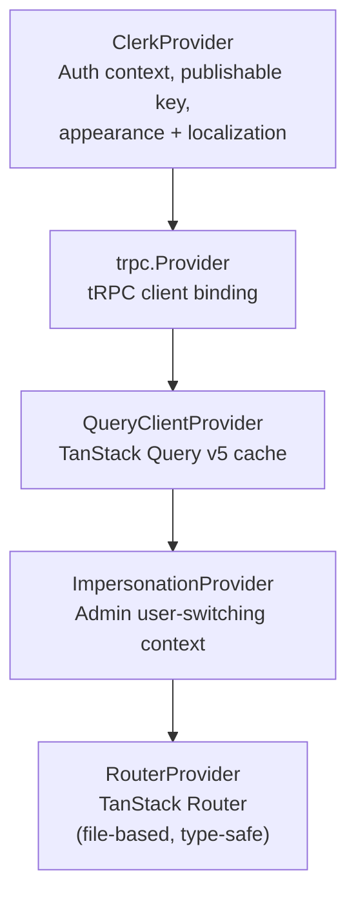
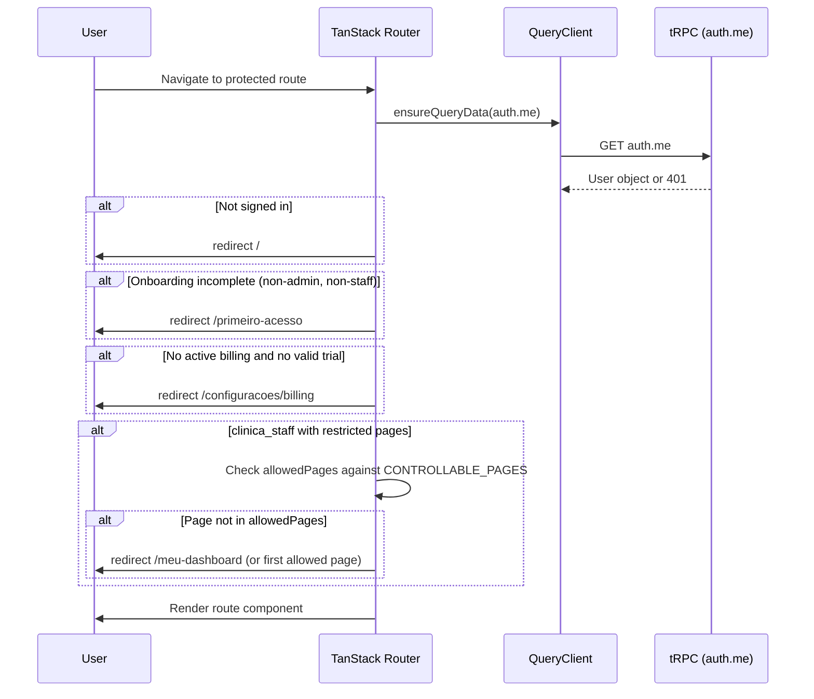

# C4 Level 3 -- Frontend Components

> Internal component view of `apps/web/src/`. For the system context and container views, see [01-system-context.md](./01-system-context.md) and [02-container-architecture.md](./02-container-architecture.md).

---

## Provider Hierarchy

The React application is bootstrapped in `apps/web/src/main.tsx`. Providers are nested in a strict order; each layer depends on the one above it.

Bootstrap sequence:
1. Resolve Clerk publishable key (env var or runtime `/api/public/config` fallback)
2. If key resolution fails, render a static error page with retry button
3. Create tRPC client, QueryClient, and Router
4. Mount the provider tree into `#root`

A stale-chunk auto-reload handler (`vite:preloadError` listener) ensures that after deploys, users with cached chunks get a single automatic page reload rather than a blank screen.

---

## Route Tree

Routes are defined as flat files in `apps/web/src/routes/` using TanStack Router's file-based convention. The dot-separated filename encodes the nesting hierarchy (e.g., `_dashboard.configuracoes.billing.tsx` maps to `/configuracoes/billing` under the dashboard layout).

### Public Routes

| Route | File | Purpose |
|-------|------|---------|
| `/` | `index.tsx` | Landing page |
| `/termos` | `termos.tsx` | Terms of service |
| `/privacidade` | `privacidade.tsx` | Privacy policy |
| `/comece-aqui` | `comece-aqui.tsx` | Public onboarding entry |
| `/primeiro-acesso` | `primeiro-acesso.tsx` | First-access onboarding wizard |
| `/account-deletion` | `account-deletion.tsx` | Meta-required data deletion page |
| `/assinar/:token` | `assinar.$token.tsx` | Remote document signing |
| `/unsubscribe/:token` | `unsubscribe.$token.tsx` | Email unsubscribe |

### Dashboard Routes (under `_dashboard` layout guard)

| Route | File | Domain |
|-------|------|--------|
| `/meu-dashboard` | `_dashboard.meu-dashboard.tsx` | Main dashboard |
| `/clientes` | `_dashboard.clientes.tsx` | Client list (layout) |
| `/clientes/:id` | `_dashboard.clientes.$id.tsx` | Client detail |
| `/pacientes` | `_dashboard.pacientes.tsx` | Patient list (layout) |
| `/pacientes/:id` | `_dashboard.pacientes.$id.tsx` | Patient detail |
| `/crm/leads` | `_dashboard.crm.leads.tsx` | CRM kanban board |
| `/financeiro` | `_dashboard.financeiro.tsx` | Financial overview |
| `/financeiro/analise` | `_dashboard.financeiro_.analise.tsx` | Financial analysis |
| `/financeiro/insights` | `_dashboard.financeiro_.insights.tsx` | Financial AI insights |
| `/agenda` | `_dashboard.agenda.tsx` | Calendar / scheduling |
| `/marketing` | `_dashboard.marketing.tsx` | Marketing hub (layout) |
| `/marketing/campaigns/new` | `_dashboard.marketing.campaigns.new.tsx` | New campaign |
| `/marketing/campaigns/:id/edit` | `_dashboard.marketing.campaigns.$id.edit.tsx` | Edit campaign |
| `/chat` | `_dashboard.chat.tsx` | WhatsApp chat interface |
| `/atividades` | `_dashboard.atividades.tsx` | Activities hub (layout) |
| `/atividades/tarefas` | `_dashboard.atividades.tarefas.tsx` | Task board |
| `/atividades/c/:channelSlug` | `_dashboard.atividades.c.$channelSlug.tsx` | Activity channel |
| `/assistente` | `_dashboard.assistente.tsx` | AI assistant |
| `/ai-agents` | `_dashboard.ai-agents.index.tsx` | AI agents overview |
| `/ai-agents/:agentType` | `_dashboard.ai-agents.$agentType.tsx` | Specific AI agent chat |
| `/academia-neon` | `_dashboard.academia-neon.tsx` | Learning academy |
| `/diagnostico` | `_dashboard.diagnostico.tsx` | Business diagnostic tool |
| `/notificacoes` | `_dashboard.notificacoes.tsx` | Notification center |
| `/workspace` | `_dashboard.workspace.tsx` | Workspace hub (layout) |
| `/workspace/issues` | `_dashboard.workspace.issues.tsx` | Workspace issues |
| `/workspace/c/:channelSlug` | `_dashboard.workspace.c.$channelSlug.tsx` | Workspace channel |

### Settings Routes (`/configuracoes/*`)

| Route | File | Domain |
|-------|------|--------|
| `/configuracoes` | `_dashboard.configuracoes.tsx` | Settings layout |
| `/configuracoes/profile` | `...profile.tsx` | User profile |
| `/configuracoes/billing` | `...billing.tsx` | Subscription / billing |
| `/configuracoes/equipe` | `...equipe.tsx` | Team management |
| `/configuracoes/gestao` | `...gestao.tsx` | Management layout |
| `/configuracoes/gestao/produtos` | `...gestao.produtos.tsx` | Product management |
| `/configuracoes/gestao/pipelines` | `...gestao.pipelines.tsx` | Pipeline configuration |
| `/configuracoes/gestao/automacoes` | `...gestao.automacoes.tsx` | Automation rules |
| `/configuracoes/integrations` | `...integrations.index.tsx` | Integration hub |
| `/configuracoes/integrations/whatsapp` | `...integrations.whatsapp.tsx` | WhatsApp config |
| `/configuracoes/integrations/instagram` | `...integrations.instagram.tsx` | Instagram + Meta OAuth |
| `/configuracoes/integrations/asaas` | `...integrations.asaas.tsx` | ASAAS payment gateway |
| `/configuracoes/integrations/kiwify` | `...integrations.kiwify.tsx` | Kiwify integration |
| `/configuracoes/integrations/hubla` | `...integrations.hubla.tsx` | Hubla integration |
| `/configuracoes/integrations/nuvem-fiscal` | `...integrations.nuvem-fiscal.tsx` | Tax/invoice config |
| `/configuracoes/ai-agents` | `...ai-agents.index.tsx` | AI agent settings hub |
| `/configuracoes/ai-agents/sdr` | `...ai-agents.sdr.tsx` | SDR agent config |
| `/configuracoes/ai-agents/patient` | `...ai-agents.patient.tsx` | Patient agent config |
| `/configuracoes/ai-agents/marketing` | `...ai-agents.marketing.tsx` | Marketing agent config |
| `/configuracoes/ai-agents/financial-coach` | `...ai-agents.financial-coach.tsx` | Financial coach config |

### Admin Routes

| Route | File | Purpose |
|-------|------|---------|
| `/admin/mentorados` | `_dashboard.admin.mentorados.tsx` | Mentorado management |
| `/admin/settings/finance-coach` | `_dashboard.admin.settings.finance-coach.tsx` | Global finance coach settings |
| `/admin/call-preparation/:mentoradoId` | `_dashboard.admin.call-preparation.$mentoradoId.tsx` | Mentor call prep |

---

## Authentication Gate

The `_dashboard.tsx` layout route acts as a universal authentication and authorization gate. Every dashboard route passes through its `beforeLoad` hook before rendering.

Authorization layers checked in order:
1. **Authentication** -- Clerk session must exist; `auth.me` must return a user.
2. **Onboarding** -- Non-admin, non-staff users must complete onboarding (redirect to `/primeiro-acesso`). Exempt routes: `/primeiro-acesso`, `/diagnostico`.
3. **Billing** -- Non-admin, non-staff users need either an active billing plan or a valid trial. Expired users go to `/configuracoes/billing`.
4. **Page access control** -- `clinica_staff` role users may have a restricted `allowedPages` array. If the target page is in `CONTROLLABLE_PAGES` but not in the user's allowed list, redirect to the first allowed page.

Settings routes (`/configuracoes/*`) are always accessible to authenticated users regardless of billing or onboarding status.

---

## Component Architecture

Components live in `apps/web/src/components/`, organized by feature domain.

| Directory | Files | Purpose |
|-----------|-------|---------|
| `ui/` | ~90 | shadcn/ui primitives (Button, Dialog, Card, etc.). **Never** place custom components here. |
| `chat/` | ~20 | WhatsApp multi-provider chat interface |
| `crm/` | ~20 | Leads kanban board, lead dialogs, pipeline views |
| `clientes/` | ~20 | Patient/client management, medical records, procedures |
| `workspace/` | -- | Workspace channels, issues, activity feeds |
| `marketing/` | -- | Campaign builder, email marketing, ads dashboards |
| `admin/` | -- | Admin panel views, mentorado management |
| `financeiro/` | -- | Financial widgets, transaction tables, charts |
| `dashboard/` | -- | Dashboard-specific widgets and KPI cards |
| `ai-chat/` | -- | AI agent chat interface components |
| `settings/` | -- | Settings page sub-components |
| `landing/` | -- | Public landing page sections |
| `instagram/` | -- | Instagram integration UI |
| `facebook-ads/` | -- | Facebook Ads integration UI |
| `ads/` | -- | Unified ads dashboard |
| `agenda/` | -- | Calendar/scheduling components |
| `auth/` | -- | Auth-related UI (sign-in prompts) |
| `mentor/` | -- | Mentor-specific views |
| `notifications/` | -- | Notification center UI |
| `whatsapp/` | -- | WhatsApp-specific shared components |
| `meta/` | -- | Meta platform shared components |
| `academia-neon/` | -- | Learning academy components |
| `shared/` | -- | Cross-feature shared components |
| `openclaw/` | -- | Open-source attribution |

Standalone layout files:
- `dashboard-layout.tsx` -- Main dashboard shell (sidebar + topbar + content area)
- `dashboard-layout-skeleton.tsx` -- Loading skeleton for the dashboard shell
- `page-container.tsx` -- Standardized page wrapper with title, breadcrumbs, padding
- `error-boundary.tsx` -- Global error boundary (generic message in prod, stack trace in dev only)
- `page-loader.tsx` -- Full-page loading spinner

---

## State Management

| Concern | Solution | Scope |
|---------|----------|-------|
| Server state | tRPC + TanStack Query v5 | Global cache, auto-refetch, optimistic updates |
| URL state | TanStack Router search params | Per-route, shareable, type-safe |
| Local UI state | `useState` / `useReducer` | Component-local, ephemeral |
| Auth state | Clerk hooks (`useUser`, `useAuth`) | Global, managed by ClerkProvider |
| Theme state | ThemeProvider (localStorage) | Persisted, class-based toggle |

There is no Redux, Zustand, or Jotai in this project. All server-state synchronization flows through tRPC queries and mutations cached by TanStack Query.

Rate limit handling: the tRPC client tracks HTTP 429 responses and blocks subsequent requests during a backoff window to prevent thundering-herd retries.

---

## Design System

### GPUS Palette

The design system uses the GPUS (Grupo US) brand palette, defined as HSL CSS custom properties in `apps/web/src/index.css`.

| Token | Light Mode | Dark Mode | Usage |
|-------|-----------|-----------|-------|
| `--primary` | Gold `38 60% 45%` | Amber `43 96% 56%` | Buttons, accents, active states |
| `--foreground` | Petroleo `203 65% 26%` | Slate 50 `210 40% 98%` | Primary text |
| `--background` | Slate 50 `210 40% 98%` | Slate 950 `222 47% 6%` | Page background |
| `--muted` | Slate 100 | Slate 800 | Secondary backgrounds |
| `--accent` | Slate 100 | Slate 800 | Hover states |
| `--destructive` | Red | Red | Error states, delete actions |

Custom tokens beyond shadcn defaults:
- `--color-neon-petroleo` -- Brand dark blue
- `--color-neon-gold` -- Brand gold
- 9 chat-specific tokens (bubble colors, timestamps, etc.)
- 5 chart tokens (data visualization palette)

### Typography and Theme

- **Font**: Manrope (variable weight)
- **CSS Framework**: Tailwind CSS v4 with `@utility` custom directives
- **Dark mode**: Class-based (`.dark` on `<html>`), toggled via ThemeProvider persisting to `localStorage`
- **Rule**: Never hardcode hex values. Use semantic tokens (`bg-primary`, `text-foreground`) or custom utility classes (`text-neon-petroleo`).

---

## Code Splitting

### Manual Vendor Chunks

The Vite config (`apps/web/vite.config.ts`) defines 14 manual vendor chunks to optimize caching:

| Chunk | Libraries |
|-------|-----------|
| `vendor-react` | react, react-dom, scheduler |
| `vendor-router` | @tanstack/react-router |
| `vendor-ui` | @radix-ui/*, class-variance-authority, clsx |
| `vendor-three` | three, @react-three/* |
| `vendor-charts` | recharts, d3-* |
| `vendor-motion` | framer-motion |
| `vendor-clerk` | @clerk/* |
| `vendor-trpc` | @trpc/*, @tanstack/react-query, superjson |
| `vendor-pdf` | @react-pdf/*, pdfjs-dist |
| `vendor-dnd` | @dnd-kit/* |
| `vendor-date` | date-fns |
| `vendor-mediapipe` | @mediapipe/* |
| `vendor-markdown` | react-markdown, remark-*, rehype-* |
| `vendor-icons` | lucide-react |

### Route-Level Splitting

- **TanStack Router `autoCodeSplitting: true`** -- Every route file is automatically code-split into its own chunk.
- **47+ lazy route files** -- Each `_dashboard.*.tsx` file is a separate async chunk loaded on navigation.
- **`React.lazy()`** -- Used for heavy non-route components (chart panels, PDF viewers, 3D scenes).

### Build Optimization

- `NODE_OPTIONS=--max-old-space-size=4096` required for CI builds to prevent OOM (see `feedback_vite_oom_ci.md`).
- `target: 'esnext'` in Vite config for modern browser output.

---

## Related Decisions

- [ADR-015: TanStack Router](adr/015-tanstack-router.md) — File-based routing with `autoCodeSplitting` on all 44+ routes
- [ADR-016: shadcn/ui + Tailwind](adr/016-shadcn-tailwind.md) — 86 owned UI components + GPUS semantic color tokens
- [ADR-018: Vite Frontend Build](adr/018-vite-frontend-build.md) — Vite 7 builds the SPA with 14 manual vendor chunks
