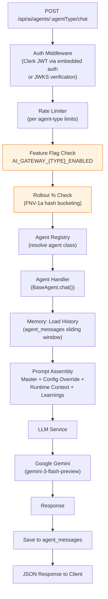
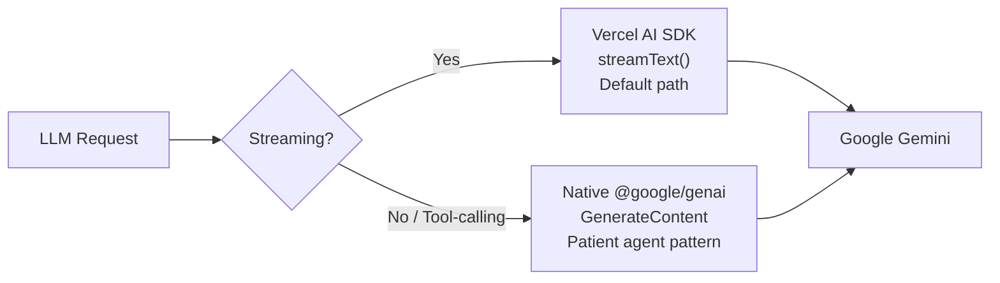
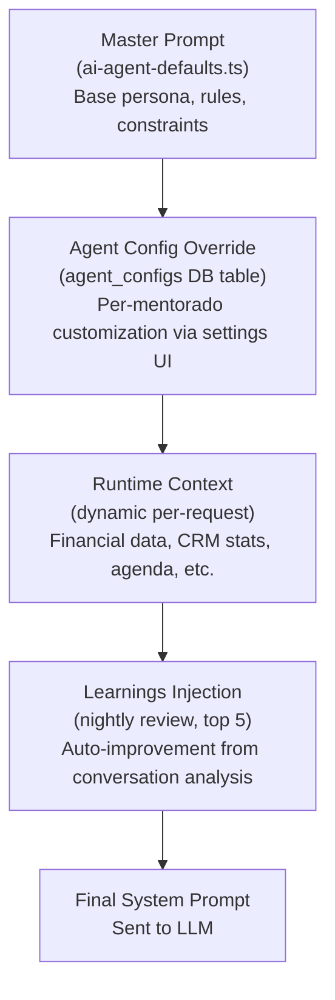
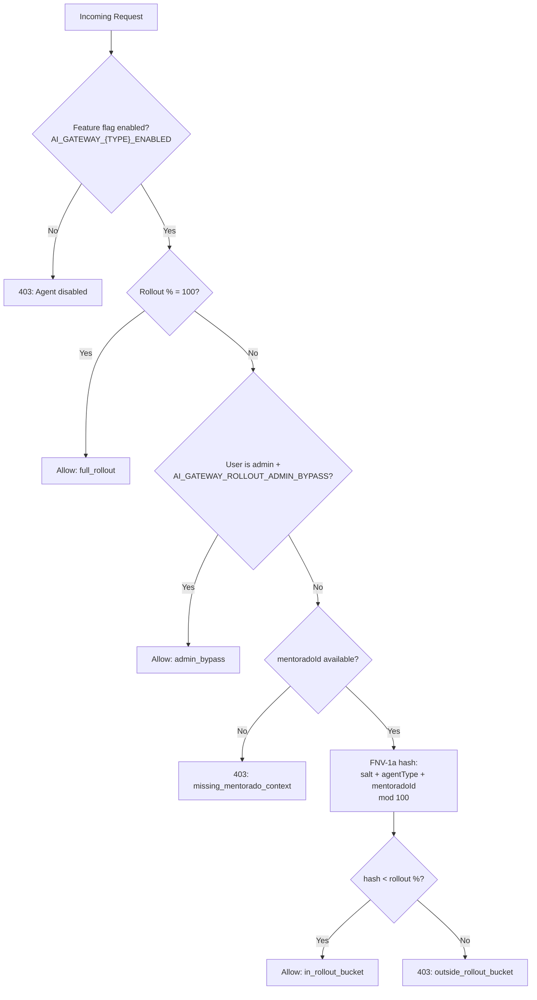

# C4 Level 3 -- AI Gateway

> Internal component view of `packages/ai-gateway/src/`. For the authoritative agent architecture reference (memory model, prompt hierarchy, agent registry with tools), see [docs/AGENTS-ARCHITECTURE.md](../AGENTS-ARCHITECTURE.md).

---

## Overview

The AI Gateway (`@neondash/ai-gateway`) is an embedded Hono sub-app mounted at `/api/ai` within the main API process. It provides a unified interface for all AI agent interactions, with per-agent feature flags, rollout controls, rate limiting, and LLM orchestration.

The gateway can also run standalone for local development and testing via `packages/ai-gateway/src/standalone.ts`.

---

## Architecture

---

## Agent Registry

All agents extend `BaseAgent` and are instantiated once at module load in `routes/agents.ts`. The Severino agent is handled separately by the Atividades module and is not registered in the gateway's agent map.

| Agent | Type | Model | Max Tokens | Temp | Timeout | Sliding Window |
|-------|------|-------|-----------|------|---------|---------------|
| SDR | `sdr` | gemini-3-flash-preview | 2048 | 0.7 | 30s | 20 messages (10 for LLM) |
| Marketing | `marketing` | gemini-3-flash-preview | 4096 | 0.8 | 60s | 10 messages |
| Patient | `patient` | gemini-3-flash-preview | 8192 | 0.4 | 120s | 15 messages |
| Financial Coach | `financial` | gemini-3-flash-preview | 4096 | 0.3 | 60s | 10 messages |
| Severino | `severino` | gemini-3-flash-preview | 4096 | 0.45 | 60s | -- (Atividades module) |
| Widget | `widget` | gemini-3-flash-preview | 2048 | 0.6 | 30s | 10 messages |

Model policies are defined in `config/constants.ts` as the `MODEL_POLICIES` record. Each agent's `ModelPolicy` specifies the model, max output tokens, temperature, and request timeout.

### Rate Limits

Per-agent rate limits (in-memory, per-user):

| Agent | Max Requests | Window |
|-------|-------------|--------|
| SDR | 60 | 60s |
| Marketing | 20 | 60s |
| Patient | 30 | 60s |
| Financial | 20 | 60s |
| Severino | 30 | 60s |
| Widget | 40 | 60s |

---

## LLM Service

`services/LLMService.ts` provides two invocation paths for calling Google Gemini:

| Path | Library | Use Case | Features |
|------|---------|----------|----------|
| Vercel AI SDK | `@ai-sdk/google` + `ai` | Default streaming responses | `streamText()`, `generateText()`, automatic token counting |
| Native GenAI | `@google/genai` | Tool-calling loops | `GoogleGenAI`, manual function call dispatch, multi-turn tool execution |

The LLM Service also applies prompt optimization (`PromptOptimizerService`) to reduce token usage: system prompt compression, message history truncation, and content deduplication.

---

## Memory Infrastructure

> The authoritative memory model is documented in [docs/AGENTS-ARCHITECTURE.md](../AGENTS-ARCHITECTURE.md). This section summarizes the live architecture.

The AI Gateway uses 3 Postgres-backed memory layers:

| Layer | Table | Purpose | Lifecycle |
|-------|-------|---------|-----------|
| Conversation History | `agent_messages` | Sliding window of recent messages per agent per mentorado | Written on every chat turn; older messages fall off the window |
| Learnings | `agent_learnings` | Nightly distillations of conversation patterns | Written by nightly review job; top 5 injected into prompt |
| Config Overrides | `agent_configs` | Per-mentorado prompt overrides and enable/disable flags | Written via settings UI; applied at prompt assembly time |

Previously implemented layers (Working Memory, Episodic Memory, Procedural Memory, Identity Documents, Sessions/Observations, Memory Events, Inter-agent Redis Pub/Sub) were removed following a YAGNI cleanup. See `docs/AGENTS-ARCHITECTURE.md` for the full removal rationale.

---

## Prompt Hierarchy

Every agent prompt is assembled from four layers, applied in order:

All agent prompts follow the structure: `[ROLE] -> [GOAL] -> [TASKS] -> [RULES] -> [CONSTRAINTS]`.

---

## Host Adapters

The `HostAdapters` interface (`types/hostAdapters.ts`) provides AI agents with access to platform capabilities through the host API process. These adapters are injected at gateway creation time via `createAiGatewayRuntime({ hostAdapters })`.

| Adapter | Interface | Capabilities |
|---------|-----------|-------------|
| `whatsapp` | `WhatsAppSendRequest` / `WhatsAppSendResult` | Send text messages via Baileys, Z-API, or Meta Cloud API; retrieve recent conversations |
| `email` | `EmailSendRequest` | Send emails via Resend |
| `tasks` | `TaskCreateRequest` | Create tasks in the task system |
| `calendar` | `AgendaItem[]` | Retrieve today's agenda items for a mentorado |
| `crm` | `CrmStats` | Get CRM pipeline statistics (leads in qualification, awaiting response, 7-day conversion rate) |
| `roleResolver` | Role lookups | Resolve user role by mentoradoId or clerkId (used for rollout admin bypass) |

The host adapter pattern decouples the AI Gateway package from direct service dependencies, allowing it to run standalone with mock adapters for testing.

---

## Rollout System

The rollout system (`config/rollout.ts`) controls which users can access each agent through a multi-layer gating mechanism.

Configuration:
- **Global rollout**: `AI_GATEWAY_ROLLOUT_PERCENT` (default for all agents)
- **Per-agent override**: `AI_GATEWAY_{TYPE}_ROLLOUT_PERCENT` (overrides global for a specific agent)
- **Admin bypass**: `AI_GATEWAY_ROLLOUT_ADMIN_BYPASS` (admins skip percentage check)
- **Deterministic bucketing**: FNV-1a 32-bit hash with `AI_GATEWAY_ROLLOUT_SALT` ensures consistent user assignment across requests

---

## Endpoints

| Method | Path | Auth | Description |
|--------|------|------|-------------|
| POST | `/api/ai/agents/:agentType/chat` | Clerk JWT (required) | Main chat endpoint. Rate-limited per agent type, feature-flagged, rollout-gated. |
| GET | `/api/ai/health` | None | Gateway health status + feature flag states + dependency status |
| GET | `/api/ai/metrics` | None | Prometheus-format metrics (request counts, latencies, error rates) |

The admin routes (`/api/ai/admin/*`) provide additional management capabilities.

---

## Background Jobs

Three recurring jobs run within the gateway runtime:

| Job | Schedule | Environment | Purpose |
|-----|----------|-------------|---------|
| Heartbeat | Every 6 hours | Production only | Agent health checks, stale session cleanup |
| Nightly Review | 03:00 UTC daily | Production only | Analyze conversations, distill learnings into `agent_learnings` |
| Proactive Heartbeat | Every 2h, 08:00--18:00 Mon--Fri | When `AI_GATEWAY_PROACTIVE_HEARTBEAT_ENABLED` | Proactive outreach triggers |

---

## Internal Services

| Service | File | Purpose |
|---------|------|---------|
| LLMService | `services/LLMService.ts` | Unified Gemini invocation (streaming + tool-calling) |
| MemoryService | `services/MemoryService.ts` | Conversation history load/save, learning retrieval |
| NeonDBService | `services/NeonDBService.ts` | Typed Drizzle queries for agent_messages, mentorado lookup |
| PromptService | `services/PromptService.ts` | Prompt assembly from hierarchy layers |
| PromptOptimizerService | `services/PromptOptimizerService.ts` | Token reduction: prompt compression, history truncation |
| IdentityService | `services/IdentityService.ts` | Agent identity resolution and context |
| EmbeddingService | `services/EmbeddingService.ts` | Text embedding generation (for future hybrid search) |
| AgentCommunicationService | `services/AgentCommunicationService.ts` | Inter-agent messaging via Redis pub/sub |
| WorkspaceService | `services/WorkspaceService.ts` | Workspace integration for Severino agent |

---

## Infrastructure

| Component | File | Purpose |
|-----------|------|---------|
| Logger | `infra/logger.ts` | Pino-based structured logging |
| Redis Bus | `infra/redis.ts` | Redis pub/sub for inter-agent communication (degraded mode if unavailable) |
| SQLite | `infra/sqlite.ts` | Local SQLite for session/observation cache |
| NeonDB | `infra/neondb.ts` | Drizzle ORM connection to shared Neon PostgreSQL |

The gateway operates in **degraded mode** when Redis is unavailable: inter-agent communication is disabled, but all other functionality (chat, memory, rollout) continues to work.

---

## Related Decisions

- [ADR-002: Embedded AI Gateway](adr/002-embedded-ai-gateway.md) — Rationale for embedding the gateway as a Hono sub-app vs separate microservice
- [ADR-007: Redis Dual-Purpose](adr/007-redis-dual-purpose.md) — Redis pub/sub used for inter-agent communication with hop-count guards
- [ADR-021: Google Gemini](adr/021-gemini-ai-provider.md) — `gemini-2.0-flash` powers all 6 agent types described in this doc
