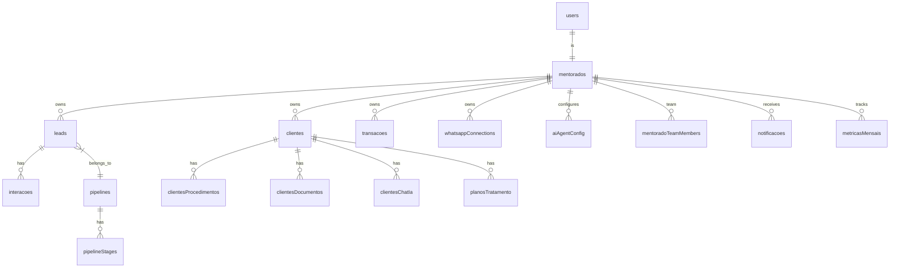

# Data Architecture

> Schema-first design with Drizzle ORM on Neon PostgreSQL. ~121 tables, ~64 pgEnum types, multi-tenant isolation via `mentoradoId` FK.

---

## Schema Organization

| File | Domain | Approx Tables |
|------|--------|--------------|
| `drizzle/schema-core.ts` | Core identity (users, mentorados, whatsappConnections) | 3 |
| `drizzle/schema.ts` | Primary: CRM, finance, clinical, AI, ads, etc. | ~85 |
| `drizzle/schema-marketing.ts` | Marketing campaigns, posts, branding, IG automation | 14 |
| `drizzle/schema-email-marketing.ts` | Email audiences, contacts, campaigns, events, templates | 6 |
| `drizzle/schema-workspace.ts` | Workspace channels, messages, issues | 6 |
| `drizzle/schema-automations.ts` | Automation tracks, steps, instances | 4 |
| `drizzle/schema-baileys.ts` | Baileys session storage | 1 |
| `drizzle/schema-trail-instances.ts` | Trail instances | 1 |
| `drizzle/schema-trail-templates.ts` | Trail templates | 1 |
| `drizzle/relations.ts` | All Drizzle relation definitions | -- |

**Circular dependency strategy:** `schema-core.ts` houses foundational tables (`users`, `mentorados`, `whatsappConnections`) and shared enums. Sub-schema files import from `schema-core`, never from `schema.ts`, breaking the cycle. The main `schema.ts` re-exports everything.

---

## Domain Table Groupings

- **Core Identity:** `users`, `mentorados`, `mentoradoTeamMembers`
- **CRM:** `leads`, `pipelines`, `pipelineStages`, `interacoes`, `crmColumnConfig`, `tags`, `objections`, `leadTags`
- **Finance:** `transacoes`, `transacoesRecorrencias`, `categoriasFinanceiras`, `formasPagamento`, `nfseCreditos`
- **Clinical / Clients:** `clientes`, `clientesProdutos`, `clientesPagamentos`, `clientesInfoMedica`, `clientesMentoriaPerfil`, `clientesProcedimentos`, `clientesFotos`, `clientesDocumentos`, `clientesChatIa`, `planosTratamento`, `clientesConsentimentos`
- **Gamification:** `metricasMensais`, `feedbacks`, `badges`, `mentoradoBadges`, `rankingMensal`, `metasProgressivas`
- **Notifications:** `notificacoes`, `mentoradoNotificationPreferences`, `notificationSettings`
- **AI / Agents:** `openclawSessions`, `openclawMessages`, `aiAgentConfig`, `agentMessages`, `agentLearnings`, `agentConfigs`
- **WhatsApp:** `whatsappConnections`, `whatsappMessages`, `whatsappContacts`, `whatsappConversations`, `baileysSessions`
- **Ads / Social:** `instagramTokens`, `facebookAdsTokens`, `facebookAdAccounts`, `facebookAdsInsights`, `googleAdsTokens`, `googleAdsInsights`
- **Education:** `classes`, `classProgress`, `playbookModules`, `playbookItems`, `trailTemplates`, `trailInstances`
- **Workspace:** `workspaceChannels`, `workspaceMessages`, `workspaceIssues`

---

## Multi-Tenant Isolation

This is the most critical security invariant in the data layer.

- Nearly all tables have `mentoradoId FK -> mentorados.id` with `onDelete: "cascade"`
- `mentoradoProcedure` (tRPC middleware) resolves the authenticated user's mentorado and injects it into the tRPC context
- **ALL queries MUST include `WHERE mentoradoId = ctx.mentorado.id`** -- violating this is a critical security bug that leaks data across tenants
- Admin/mentor roles can bypass tenant binding for cross-tenant operations (impersonation header `x-impersonate-mentorado-id`)

---

## Multi-Database Routing

The system supports routing queries to different Neon database instances based on business context:

```typescript
// apps/api/src/db.ts
export function getDbForContext(contexto: ClienteContexto | null | undefined) {
  if (contexto === "clinica") {
    // DATABASE_URL_CLINICA (falls back to DATABASE_URL)
    return dbClinica;
  }
  if (contexto === "mentoria") {
    // DATABASE_URL_MENTORIA (falls back to DATABASE_URL)
    return dbMentoria;
  }
  return db; // DATABASE_URL (default)
}
```

Each context-specific database instance is lazily initialized with its own connection pool:

| Parameter | Value |
|-----------|-------|
| Pool size (`max`) | 10 |
| Idle timeout | 30s |
| Connection timeout | 10s |
| Query logging | Development only |

If a context-specific connection string matches the default `DATABASE_URL`, the system reuses the default pool to avoid redundant connections.

---

## Core ERD



---

## Migration Workflow

- **Command:** `bun run db:push` (Drizzle Kit push)
- **Approach:** Schema-first -- no migration files are tracked in version control
- **Source of truth:** The TypeScript schema files in `apps/api/drizzle/`
- **No manual SQL** -- all schema changes go through Drizzle Kit
- **Process:** Edit schema `.ts` files, then run `bun run db:push` to apply

---

## Key Conventions

| Convention | Rule |
|------------|------|
| FK indexes | Every FK column MUST have a corresponding index -- no exceptions |
| Soft deletes | Use `ativo` boolean column, never physical `DELETE` |
| Type exports | Export `Type` and `InsertType` for every table |
| Enum naming | camelCase export name, snake_case DB name (e.g., `roleEnum` -> `"role"`) |
| Prepared statements | Use `sql.placeholder()` + `.prepare()` for hot-path queries |
| Column selection | Never `SELECT *` -- always specify columns explicitly |
| Array guards | Always guard `.returning()` / `.select()` against empty arrays before destructuring |

---

## Related Decisions

- [ADR-006: Multi-Tenant Isolation](adr/006-multi-tenant-mentorado-isolation.md) — `mentoradoId` FK on all tables is the foundational data isolation pattern described here
- [ADR-012: Neon PostgreSQL](adr/012-neon-postgresql.md) — Neon hosts all 121+ tables; the 3-context connection model is documented here
- [ADR-014: Drizzle ORM](adr/014-drizzle-orm.md) — Drizzle manages schema definitions and migrations; the 10-file schema split is motivated by Drizzle's circular dependency handling
