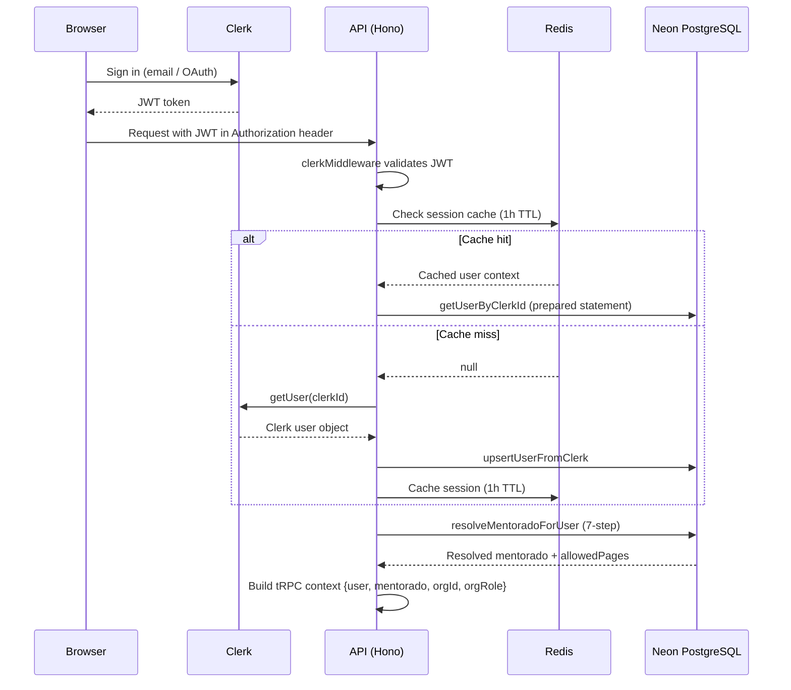
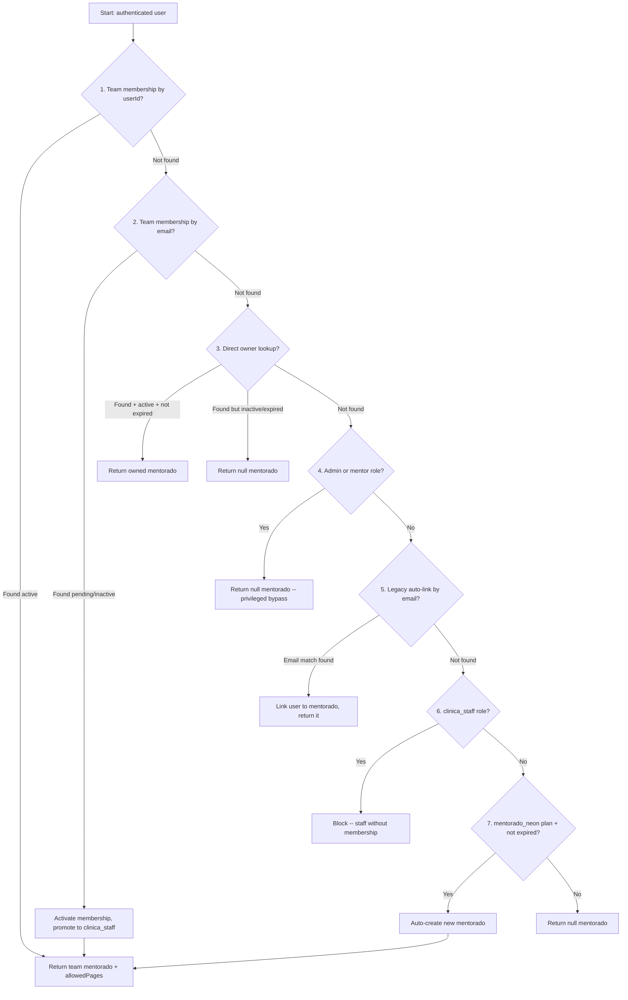

# Security Architecture

> Clerk-based authentication, Redis-cached sessions, 7-step mentorado resolution, provider-specific webhook verification, and defense-in-depth headers.

---

## Auth Flow

---

## Mentorado Resolution Priority

The `resolveMentoradoForUser` function in `apps/api/src/_core/context.ts` implements a 7-step resolution chain:

Key behaviors:
- **Step 1 wins over Step 3:** A team invitation always takes priority over direct mentorado ownership, transferring the user to the organization's data
- **Step 2 auto-activates:** Pending email invitations activate on first login
- **Step 4 bypass:** Admin/mentor roles operate without tenant binding
- **Step 7 self-heals:** `mentorado_neon` users with incorrect `billingStatus` are auto-corrected to `"active"`

---

## Procedure Hierarchy

| Procedure | Auth Level | Middleware |
|-----------|-----------|------------|
| `publicProcedure` | None | Health checks only |
| `protectedProcedure` | Clerk JWT | Requires `ctx.user` |
| `mentoradoProcedure` | Clerk JWT + tenant | Requires `ctx.user` + `ctx.mentorado` |
| `adminProcedure` | Clerk JWT + role | Requires `ctx.user.role` in `["admin", "mentor"]` |

---

## CORS Policy

| Environment | Behavior | Rationale |
|-------------|----------|-----------|
| Production | `CORS_ORIGIN` env var required (comma-separated explicit origins) | Wildcard throws fatal startup error (Stability Rule G) |
| Development | Mirrors request `Origin` header | `credentials:true` + wildcard `*` breaks SSE/EventSource in browsers |

Both modes use `credentials: true` for Clerk cookie-based auth.

---

## Rate Limiting

| Limiter | Scope | Limit | Window | Exempt |
|---------|-------|-------|--------|--------|
| User rate limiter | Per userId or IP on `/api/trpc/*` | 500 requests | 15 min | admin, mentor roles |
| Auth rate limiter | Per IP on auth endpoints | 10 requests | 15 min | -- |
| AI Gateway: sdr | Per user + agent type | 60 requests | 1 min | admin bypass |
| AI Gateway: marketing | Per user + agent type | 20 requests | 1 min | admin bypass |
| AI Gateway: patient | Per user + agent type | 30 requests | 1 min | admin bypass |
| AI Gateway: financial | Per user + agent type | 20 requests | 1 min | admin bypass |
| AI Gateway: severino | Per user + agent type | 30 requests | 1 min | admin bypass |
| AI Gateway: widget | Per user + agent type | 40 requests | 1 min | admin bypass |

Rate limit headers are returned on every response: `X-RateLimit-Limit`, `X-RateLimit-Remaining`, `X-RateLimit-Reset`, `Retry-After`.

---

## Webhook Verification

| Provider | Method | Key / Secret |
|----------|--------|-------------|
| Stripe | `stripe.webhooks.constructEvent()` | `STRIPE_WEBHOOK_SECRET` |
| Clerk | Svix library (`new Webhook(secret)`) with svix-id/timestamp/signature headers | `CLERK_WEBHOOK_SECRET` |
| Resend | Svix headers (`svix-id`, `svix-timestamp`, `svix-signature`) + idempotency via svixId column | `RESEND_WEBHOOK_SECRET` |
| Meta / WhatsApp | `META_WEBHOOK_VERIFY_TOKEN` challenge (GET) + custom payload verification (POST) | `META_WEBHOOK_VERIFY_TOKEN` |
| ASAAS | Custom token verification (`asaas-access-token` or `asaas-webhook-token` header) | `ASAAS_WEBHOOK_TOKEN` |

---

## Security Headers

Applied via Hono `secureHeaders()` middleware and Traefik labels:

| Header | Value |
|--------|-------|
| X-Frame-Options | `SAMEORIGIN` |
| X-Content-Type-Options | `nosniff` |
| Strict-Transport-Security | `max-age=31536000; includeSubDomains` |
| Referrer-Policy | `strict-origin-when-cross-origin` |
| Permissions-Policy | `geolocation=(self), microphone=(), camera=(self)` |

---

## Encryption at Rest

- `ENCRYPTION_KEY` is validated at server startup; missing key causes fatal error
- Algorithm: **AES-256-GCM** (authenticated encryption)
- Format: `salt:iv:tag:ciphertext` (all base64-encoded)
- Used for: OAuth token encryption (Meta, Google, etc.) via `apps/api/src/services/crypto.ts`
- Key derivation: `scrypt` with cached key buffer to avoid repeated derivation

---

## AI Gateway Auth

| Mode | Auth Method |
|------|-------------|
| Embedded (default) | Trusts parent Hono Clerk middleware -- no additional auth |
| Standalone | Verifies Clerk JWT via JWKS endpoint (RS256) |
| Development | `X-Dev-User-Id` header bypass (only when `NODE_ENV=development`) |

---

## Trust Zones

```mermaid
flowchart LR
    subgraph Public["Public Zone (no auth)"]
        H1["/health/live"]
        H2["/health/ready"]
        H3["/metrics"]
        H4["OAuth callback GETs"]
        H5["/api/signing/:token"]
        H6["/api/email/unsubscribe/:token"]
    end

    subgraph Webhook["Webhook Zone (provider signatures)"]
        W1["/api/webhooks/stripe"]
        W2["/api/webhooks/clerk"]
        W3["/api/webhooks/meta"]
        W4["/api/webhooks/asaas"]
        W5["/api/webhooks/resend"]
        W6["/api/webhooks/hubla"]
    end

    subgraph Auth["Authenticated Zone (Clerk JWT)"]
        A1["/api/trpc/* (protectedProcedure)"]
        A2["/api/chat/events (SSE)"]
        A3["/api/ai/* (AI Gateway)"]
    end

    subgraph Tenant["Mentorado Zone (user + tenant)"]
        T1["mentoradoProcedure routes"]
    end

    subgraph Admin["Admin Zone (role check)"]
        AD1["adminProcedure routes"]
        AD2["Impersonation (x-impersonate-mentorado-id)"]
    end

    Public --> Webhook --> Auth --> Tenant --> Admin
```

---

## Impersonation

Admin and mentor roles can impersonate any mentorado by sending the `x-impersonate-mentorado-id` header:

1. Header value is parsed as a numeric mentorado ID
2. Target mentorado is loaded from the database
3. `ctx.mentorado` is replaced with the target
4. `ctx.isImpersonating` is set to `true`
5. All operations execute in the target's tenant context
6. Impersonation is logged with actor userId, role, and target mentoradoId

---

## Related Decisions

- [ADR-006: Multi-Tenant Isolation](adr/006-multi-tenant-mentorado-isolation.md) — The 7-step mentorado resolution and WHERE clause enforcement are the security implementation of this ADR
- [ADR-007: Redis Dual-Purpose](adr/007-redis-dual-purpose.md) — Redis session cache (1h TTL) is the performance layer for Clerk JWT validation
- [ADR-011: Clerk Authentication](adr/011-clerk-authentication.md) — All auth flows documented here delegate identity management to Clerk
