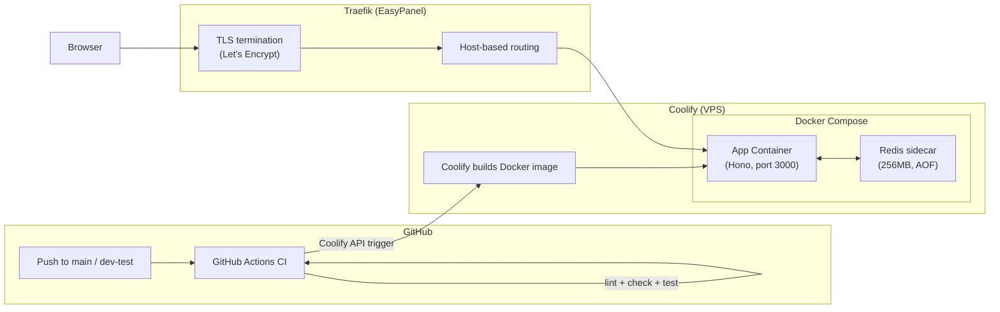
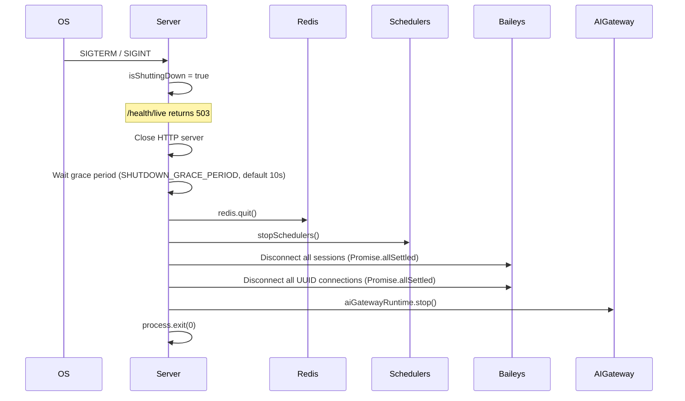

# Deployment Architecture

> GitHub Actions CI/CD pipeline deploying to Coolify on a VPS with Traefik reverse proxy, TLS termination, and Redis sidecar.

---

## Infrastructure Diagram



---

## Deployment Targets

| Branch | Target | URL | Concurrency |
|--------|--------|-----|-------------|
| `main` | Production | neondash.com.br | No cancel-in-progress |
| `dev-test` | Staging | staging.neondash.com.br | Cancel-in-progress |

---

## CI/CD Pipeline

Each deployment follows these steps:

### 1. Verify Job (CI)

| Step | Command |
|------|---------|
| Checkout | `actions/checkout@v4` |
| Setup Bun | `oven-sh/setup-bun@v2` (Bun 1.3.9) |
| Cache dependencies | Keyed on `bun.lock` hash |
| Install | `bun install --frozen-lockfile` |
| Cache Turbo | Keyed on `github.sha` |
| Lint + Type Check + Test | `bunx turbo run lint:check check test` (parallel via TurboRepo) |

### 2. Deploy Job (CD)

| Step | Details |
|------|---------|
| Trigger Coolify | POST to Coolify deploy API with app UUID (3 retries, 15s between) |
| Poll build status | Check `/deployments/{uuid}` every 15s (max 10 min / 40 polls) |
| Health check | GET `https://{domain}/health/live` via `--resolve` to server IP (12 attempts, 15s intervals) |
| Summary | Markdown table in GitHub Step Summary |

Fallback logic: if Coolify API responses cannot be parsed after 5 attempts, the pipeline falls through to the health check as the final gate.

---

## Dockerfile (3-Stage Multi-Stage Build)

**File:** `apps/api/Dockerfile`

| Stage | Base Image | Purpose |
|-------|-----------|---------|
| `deps` | `oven/bun:1.3.9-alpine` | Install production-only dependencies (`--production`) |
| `builder` | `oven/bun:1.3.9-alpine` | Full install + build (Vite web + Bun API bundle). `VITE_*` vars injected at build time via `--build-arg` or `--secret` |
| `runtime` | `oven/bun:1.3.9-alpine` | Minimal image. Non-root user `bunuser` (UID 1001). Copies only `dist/` + workspace packages |

**Entry point:** `bun apps/api/dist/index.js`

Build-time secrets (VITE_* variables):
- `VITE_CLERK_PUBLISHABLE_KEY`
- `VITE_META_APP_ID`
- `VITE_META_CONFIG_ID`
- `VITE_META_GRAPH_API_VERSION` (default: `v24.0`)

---

## Docker Compose Variants

### Development (`docker-compose.yml`)

| Aspect | Value |
|--------|-------|
| Containers | Single app container |
| Ports | `9999:3000` (configurable via `APP_PORT`) |
| Memory limit | 1G |
| Volumes | `baileys-sessions` |
| Redis | Not included (in-memory fallback) |

### Production (`docker-compose.deploy.yml`)

| Container | Resources | Details |
|-----------|-----------|---------|
| `app` | 1.5 CPU / 1536M (reserves: 0.75 CPU / 512M) | Traefik labels, TLS, SSE flush, legacy domain redirect |
| `redis-session` | 0.25 CPU / 384M (reserves: 0.1 CPU / 128M) | Redis 7 Alpine, 256MB maxmemory, allkeys-lru, AOF persistence |

Networks:
- `easypanel` -- external attachable overlay for Traefik routing
- `backend` -- internal bridge network for app-redis communication

Volumes:
- `baileys-sessions` -- persistent WhatsApp session storage
- `redis-session-data` -- persistent Redis AOF data

---

## Health Checks

| Endpoint | Auth | Purpose | Used By |
|----------|------|---------|---------|
| `GET /health/live` | None | Liveness: returns 200 OK or 503 during shutdown | Docker HEALTHCHECK, Traefik LB, Coolify |
| `GET /health/ready` | None | Readiness: checks DB (3s timeout) + Redis + AI Gateway status | Coolify deploy health polling |
| `GET /metrics` | None | Prometheus format: heap_used, RSS, uptime | Monitoring |
| `GET /api/ai/health` | None | AI Gateway status + feature flags | AI Gateway monitoring |
| `system.healthCheck` | Clerk JWT | tRPC: cache stats, DB latency, webhook queue stats | Admin dashboard |

Docker-level health check configuration:
```
HEALTHCHECK --interval=30s --timeout=10s --start-period=30s --retries=3
  CMD wget --no-verbose --tries=1 --spider http://127.0.0.1:3000/health/live || exit 1
```

---

## Graceful Shutdown



Each shutdown step is wrapped in try-catch to ensure the sequence completes even if individual steps fail.

---

## Environment Configuration

### Required (startup fails without these)

| Variable | Purpose |
|----------|---------|
| `DATABASE_URL` | Primary Neon PostgreSQL connection string |
| `CLERK_SECRET_KEY` | Clerk backend secret for JWT validation |
| `ENCRYPTION_KEY` | AES-256-GCM key for OAuth token encryption |
| `VITE_CLERK_PUBLISHABLE_KEY` | Clerk publishable key (build-time, injected into Vite) |
| `CORS_ORIGIN` | Comma-separated allowed origins (production only; wildcard causes fatal error) |

### Required for Features

| Variable | Feature |
|----------|---------|
| `GEMINI_API_KEY` | AI agents (all 6 agent types) |
| `STRIPE_SECRET_KEY` + `STRIPE_WEBHOOK_SECRET` | Subscription billing |
| `META_APP_ID` + `META_APP_SECRET` | WhatsApp / Instagram / Facebook Ads |
| `RESEND_API_KEY` | Transactional and marketing email |
| `ASAAS_API_KEY` | Brazilian payment gateway sync |

### Optional

| Variable | Default | Purpose |
|----------|---------|---------|
| `REDIS_URL` | localhost:6379 | Session cache + AI pub/sub (in-memory fallback if unavailable) |
| `DATABASE_URL_CLINICA` | Falls back to `DATABASE_URL` | Clinica context database |
| `DATABASE_URL_MENTORIA` | Falls back to `DATABASE_URL` | Mentoria context database |
| `SHUTDOWN_GRACE_PERIOD` | `10000` (ms) | Grace period before forced exit |
| `AI_GATEWAY_*_ENABLED` | `false` | Feature flags for individual AI agents |

### Traefik Configuration (via Docker labels)

| Label | Purpose |
|-------|---------|
| `traefik.http.routers.*.tls.certresolver=letsencrypt` | Automatic TLS certificates |
| `traefik.http.services.*.loadbalancer.responseforwarding.flushinterval=-1` | Immediate SSE flush (no buffering) |
| Legacy domain redirect | `neondash.gpus.com.br` -> `neondash.com.br` (301) |

---

## Related Decisions

- [ADR-001: Bun Runtime](adr/001-bun-runtime.md) — Bun is used in all 3 Dockerfile stages (deps, builder, runtime)
- [ADR-005: Single-Process Deployment](adr/005-single-process-deployment.md) — The single Docker container architecture documented here is the implementation of this ADR
- [ADR-009: Turborepo Monorepo](adr/009-turborepo-monorepo.md) — Turborepo's task graph (`turbo run build`) orchestrates the multi-stage Docker build
