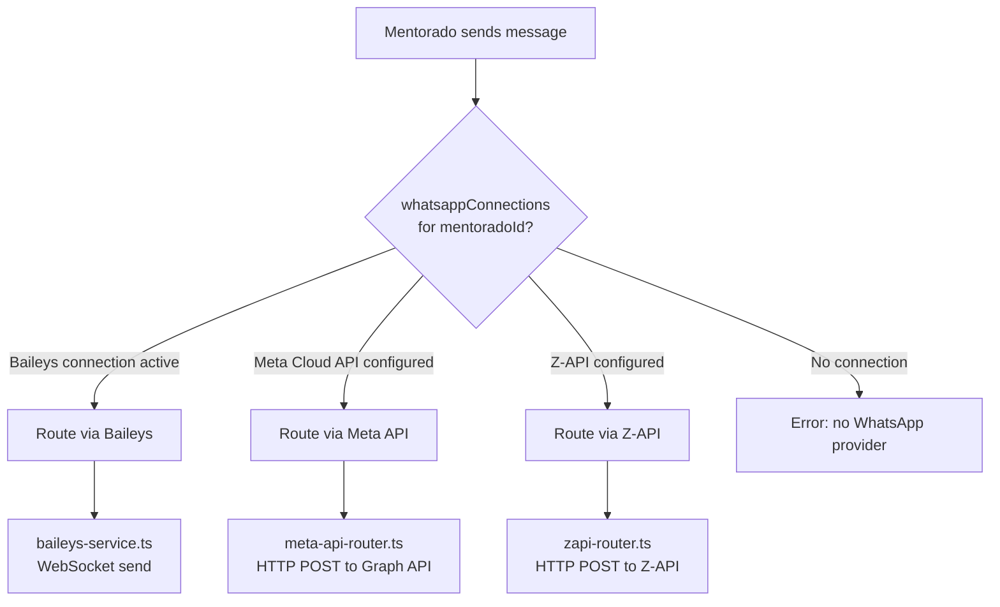
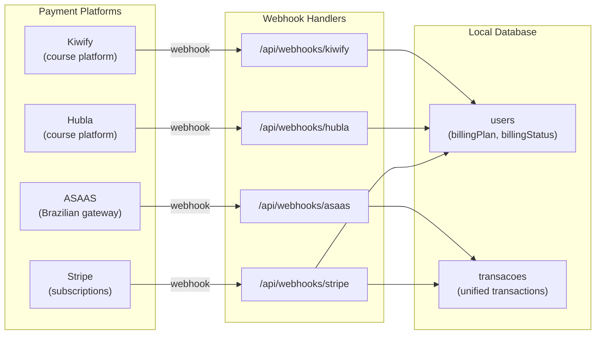
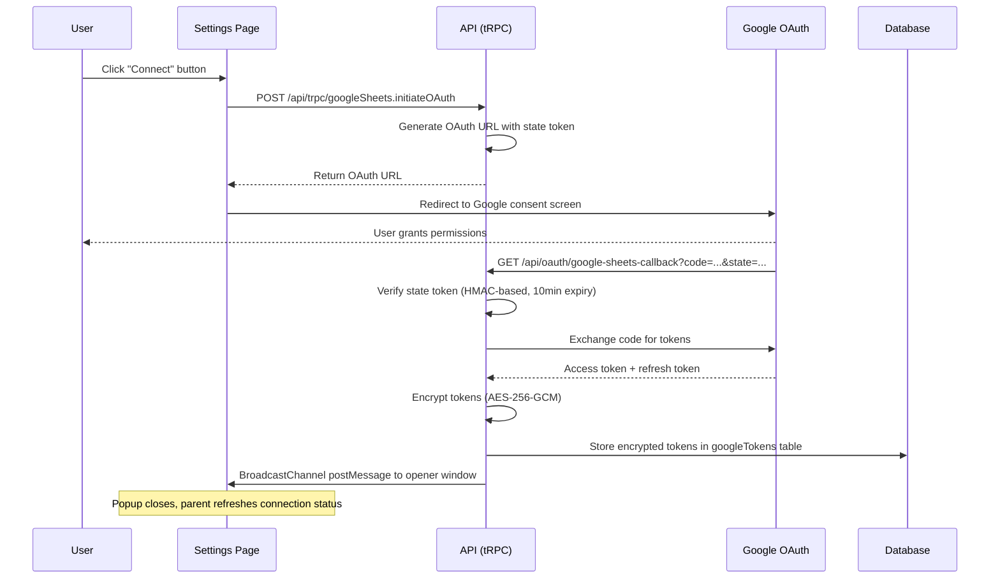

# Integration Map

> Comprehensive inventory of external services, the WhatsApp 3-provider architecture, the payment ecosystem, and the OAuth flow pattern.

---

## Integration Inventory

| Service | SDK / Library | Purpose | Auth Method | Key Env Vars |
|---------|--------------|---------|-------------|--------------|
| Clerk | `@clerk/backend`, `@clerk/clerk-react` | Authentication, JWT, orgs, RBAC | JWT / JWKS | `CLERK_SECRET_KEY`, `VITE_CLERK_PUBLISHABLE_KEY` |
| Neon PostgreSQL | `@neondatabase/serverless`, `drizzle-orm` | Primary database | Connection string | `DATABASE_URL`, `DATABASE_URL_CLINICA`, `DATABASE_URL_MENTORIA` |
| Redis | `ioredis` | Session cache + AI pub/sub | Connection string | `REDIS_URL` |
| Google Gemini | `@google/genai`, `@ai-sdk/google`, `ai` | AI inference (all 6 agent types) | API key | `GEMINI_API_KEY` |
| Stripe | `stripe` | Subscription billing, webhooks | API key + webhook secret | `STRIPE_SECRET_KEY`, `STRIPE_WEBHOOK_SECRET` |
| ASAAS | Custom HTTP | Brazilian payment gateway sync | API key + webhook token | `ASAAS_API_KEY`, `ASAAS_WEBHOOK_TOKEN` |
| Hubla | Custom webhook | Course/subscription platform | Webhook token | `HUBLA_WEBHOOK_TOKEN` |
| Kiwify | Custom | Course platform | Webhook + API | `KIWIFY_*` env vars |
| Meta Platform | Custom HTTP (axios) | WhatsApp Business, Instagram, Facebook Ads | OAuth + System User Token | `META_APP_ID`, `META_APP_SECRET`, `META_SYSTEM_USER_ACCESS_TOKEN` |
| Google Calendar | `googleapis` | Calendar sync | OAuth 2.0 | `GOOGLE_CLIENT_ID`, `GOOGLE_CLIENT_SECRET` |
| Google Sheets | `googleapis` | Bidirectional spreadsheet sync | OAuth 2.0 | `GOOGLE_SHEETS_REDIRECT_URI` |
| Google Ads | Custom HTTP | Ads management + insights | OAuth 2.0 | `GOOGLE_ADS_CLIENT_ID`, `GOOGLE_ADS_DEVELOPER_TOKEN` |
| Resend | `resend` | Transactional + marketing email | API key + webhook secret | `RESEND_API_KEY`, `RESEND_WEBHOOK_SECRET` |
| AWS S3 | `@aws-sdk/client-s3` | File + image storage | AWS credentials | S3 env vars |
| Nuvem Fiscal | Custom HTTP | NFS-e electronic invoices (Brazil) | API key | `NUVEM_FISCAL_API_KEY` |
| Brave Search | Custom HTTP | Web search tool for AI agents | API key | `BRAVE_SEARCH_API_KEY` |
| Notion | `@notionhq/client` | Notion integration | API key | `NOTION_API_KEY` |
| Svix | `svix` | Webhook signature verification (Clerk, Resend) | Signing secret | Via provider webhook secrets |
| Coolify | REST API | Deployment orchestration | API token | `COOLIFY_API_TOKEN` |

---

## WhatsApp 3-Provider Architecture

### Provider Comparison

| Aspect | Z-API | Baileys | Meta WhatsApp Cloud API |
|--------|-------|---------|------------------------|
| Protocol | REST API (third-party) | WebSocket (direct WA Web protocol) | REST API (official Meta) |
| Status | Legacy (being phased out) | Current primary | Official alternative |
| Auth | Z-API account credentials | PostgreSQL-backed auth state (`baileysSessions` table) | System User Access Token |
| Session management | Z-API managed externally | Local, persistent via DB | Account-level (no session) |
| Rate limits | Z-API platform limits | WhatsApp protocol limits | Meta API rate limits |
| Router file | `zapi-router.ts` | `baileys-router.ts` | `meta-api-router.ts` |
| QR pairing | Z-API dashboard | In-app QR via SSE stream | No QR -- phone number registration |

### Provider Selection Flow



Each mentorado configures their preferred WhatsApp provider via the `whatsappConnections` table, which stores the connection type, credentials, and status.

---

## Payment Ecosystem



- **Stripe** manages subscription lifecycle (creation, renewal, cancellation) and updates `users.billingPlan` / `users.billingStatus`
- **ASAAS** syncs payment events into the `transacoes` table for Brazilian billing in the Gestao de Clientes module
- **Hubla** and **Kiwify** handle course/subscription platform webhooks, updating user access and billing status
- All payment webhooks use provider-specific signature verification (see Security Architecture)

---

## OAuth Flow Pattern

The following sequence diagram shows the Google OAuth flow as a representative example. All OAuth integrations (Google Calendar, Google Sheets, Google Ads, Instagram, Facebook Ads) follow this same pattern:



Key security measures in OAuth flows:
- **State verification:** HMAC-based state tokens with 10-minute expiry prevent CSRF
- **Token encryption:** All OAuth tokens are encrypted at rest using the `ENCRYPTION_KEY`
- **Redirect URI validation:** `META_OAUTH_STATE` module verifies redirect URIs match configured values
- **Popup pattern:** OAuth consent opens in a popup; `BroadcastChannel` notifies the parent window on completion

---

## Webhook Registration

All webhook handlers are registered during server startup in `apps/api/src/_core/index.ts`:

```
registerStripeWebhook(app)
registerAsaasWebhook(app)
registerHublaWebhook(app)
handleClerkWebhook (inline POST handler)
registerZapiWebhooks(app)
registerBaileysWebhooks(app)
registerMetaWebhooks(app)
registerInstagramAutomationWebhook(app)
registerResendWebhook(app)
registerCampaignScheduler(app)
```

Webhook processing uses a queue (`p-queue`) for Clerk webhooks with concurrency 5, rate-capped at 10/second, and 3 retries with backoff. Failed tasks are stored (max 500) for admin review and manual retry via the `system.retryFailedWebhooks` tRPC mutation.

---

## Related Decisions

- [ADR-003: Three-Provider WhatsApp](adr/003-multi-whatsapp-providers.md) — The WhatsApp 3-provider architecture is documented in detail in this map
- [ADR-020: Dual Payment Strategy](adr/020-dual-payment-strategy.md) — Stripe + ASAAS dual gateway is reflected in the integration inventory
- [ADR-021: Google Gemini](adr/021-gemini-ai-provider.md) — Google Gemini integration details appear in the AI inference row
