# Meta API Integration Skill

> **Purpose:** Configure and maintain connections to Meta's APIs for WhatsApp Business, Instagram, and Facebook Ads with best practices for OAuth, token management, and webhook handling.
> **Core Principle:** Centralize Meta config in `apps/api/src/_core/meta-config.ts`, validate webhook signatures on every request, and refresh tokens before expiry.

---

## When to Use

### Trigger Symptoms (Use this skill when...)

- Connecting Meta APIs (WhatsApp Business, Instagram, Facebook Ads) or Google Ads API
- Implementing OAuth flows, token exchange, or refresh
- Configuring Embedded Signup for WhatsApp
- Setting up webhook endpoints for real-time events
- Debugging authentication errors, rate limits, or API failures
- OAuth errors appear (`OAuthException`, `origin_mismatch`)
- Tokens expire unexpectedly or Instagram connection fails
- Webhook signatures fail validation
- Graph API version upgrade needed

### When NOT to Use

- Generic backend work → use `debugger` backend-debug pack
- Bug investigation → use `debugger` skill
- Planning new integrations → use `planning` skill

---

## Architecture Overview

```mermaid
flowchart LR
  Browser["Browser (NeonDash)"] --> MetaPopup["Meta OAuth (Facebook Login)"]
  Browser --> GooglePopup["Google OAuth (Google Ads)"]
  MetaPopup --> CallbackMeta["/api/instagram/callback | /api/facebook-ads/callback"]
  GooglePopup --> CallbackGoogle["/api/google-ads/callback"]
  CallbackMeta --> Settings["/configuracoes/integrations/instagram"]
  CallbackGoogle --> Settings
  Settings --> TRPC["tRPC mutations (saveToken/handleCallback)"]
  TRPC --> TokenExchange["Server-side token exchange"]
  TokenExchange --> DB[("Neon Postgres")]
  DB --> SyncJobs["syncMetrics"]
  SyncJobs --> GraphAPI["Meta Graph API"]
  SyncJobs --> GoogleAdsAPI["Google Ads API"]
  GraphAPI --> Dashboard["Instagram/Facebook metrics UI"]
  GoogleAdsAPI --> Dashboard["Google Ads metrics UI"]
```



Canonical flow:
1. **Meta:** `FB.login` on frontend + server-side token persistence (`instagram.saveToken`, `facebookAds.saveToken`).
2. **Google Ads:** Separate OAuth + callback `/api/google-ads/callback` + server-side persistence (`googleAds.handleCallback`).
3. **Sync:** External APIs → insight tables → UI.

---

## Quick Start Checklists

### ✅ WhatsApp Business Platform

1. [ ] Create Meta App at [developers.facebook.com](https://developers.facebook.com)
2. [ ] Add "WhatsApp" product to the app
3. [ ] Configure Embedded Signup (see [embedded-signup-flow.md](references/embedded-signup-flow.md))
4. [ ] Set environment variables (see [env-vars-template.md](references/env-vars-template.md))
5. [ ] Implement OAuth callback handler (see [oauth-flows.md](references/oauth-flows.md))
6. [ ] Configure webhooks (see [webhook-setup.md](references/webhook-setup.md))
7. [ ] Submit for Business Verification (production only)

### ✅ Instagram Graph API

1. [ ] Create Meta App with "Facebook Login" product
2. [ ] Request permissions: `instagram_basic`, `instagram_content_publish`, `pages_show_list`
3. [ ] Link Facebook Page to Instagram Business/Creator account
4. [ ] Implement OAuth flow with token exchange (see [oauth-flows.md](references/oauth-flows.md))
5. [ ] Set `INSTAGRAM_*` environment variables

### ✅ Google Ads API

1. [ ] Create Google Cloud Console project with `Google Ads API` enabled
2. [ ] Create OAuth 2.0 Web Application client
3. [ ] Add authorized redirect URI: `/api/google-ads/callback` (all valid domains)
4. [ ] Set environment variables: `GOOGLE_ADS_CLIENT_ID`, `GOOGLE_ADS_CLIENT_SECRET`, `GOOGLE_ADS_REDIRECT_URI`, `GOOGLE_ADS_DEVELOPER_TOKEN`, `GOOGLE_ADS_LOGIN_CUSTOMER_ID`
5. [ ] Implement OAuth callback and token refresh (see [google-ads-oauth.md](references/google-ads-oauth.md))
6. [ ] Verify access to target Google Ads accounts and developer token validity

### ✅ Facebook Marketing API

1. [ ] Create Meta App at developers.facebook.com
2. [ ] Add "Marketing API" product
3. [ ] Request permissions: `ads_read`, `ads_management`, `business_management`
4. [ ] Complete App Review for Standard Access (non-expiring tokens)
5. [ ] Implement OAuth with long-lived token exchange (see [oauth-flows.md](references/oauth-flows.md))
6. [ ] Set `FACEBOOK_ADS_*` environment variables

---

## Live Docs Lookup (Context7)

When debugging OAuth or API issues, fetch live docs:
- Meta Graph API → resolve library ID, query for current endpoints, webhook payload formats, breaking changes
- WhatsApp Cloud API → resolve for message templates, webhook event types
- `googleapis` / Google Ads API → resolve for OAuth 2.0 flows, token refresh patterns

---

## Reference Documents

| Document | Purpose |
| ----------------------------------------------------------- | ----------------------------------------------------- |
| [oauth-flows.md](references/oauth-flows.md) | OAuth 2.0 flows, token exchange, refresh patterns |
| [embedded-signup-flow.md](references/embedded-signup-flow.md) | WhatsApp Embedded Signup implementation |
| [webhook-setup.md](references/webhook-setup.md) | Webhook configuration, signature validation, payloads |
| [env-vars-template.md](references/env-vars-template.md) | Environment variable template with annotations |
| [troubleshooting.md](references/troubleshooting.md) | Common errors, debugging tools, solutions |
| [instagram-runbook.md](references/instagram-runbook.md) | Instagram connection failure runbook (JS SDK + Hono/tRPC) |
| [meta-dashboard-checklist.md](references/meta-dashboard-checklist.md) | Meta Developer App configuration checklist |
| [google-ads-oauth.md](references/google-ads-oauth.md) | Google Ads OAuth flow, Cloud Console setup, token refresh |

---

## Codebase Reference

### Shared Configuration (Single Source of Truth)

All Meta services in NeonDash share `apps/api/src/_core/meta-config.ts`, which provides:

- **Unified Graph API version** (env-driven fallback in code) — change once, applies everywhere
- **`GRAPH_API_BASE`** / **`OAUTH_DIALOG_BASE`** — pre-built URL bases
- **`META_APP_ID`** / **`META_APP_SECRET`** — unified credentials with legacy fallbacks
- **Per-product scopes** — `INSTAGRAM_SCOPES`, `FACEBOOK_ADS_SCOPES`, `WHATSAPP_SCOPES`
- **Shared types** — `MetaTokenResponse`, `MetaLongLivedTokenResponse`
- **Helper functions** — `buildGraphUrl()`, `exchangeCodeForToken()`, `refreshLongLivedToken()`

> Agent rules for Meta services are documented in `apps/api/src/services/AGENTS.md`

### Implementation Files

| File | Purpose |
| -------------------------------------------------- | ----------------------------------------------------------------------- |
| `apps/api/src/_core/meta-config.ts` | Shared config — versions, credentials, scopes, helpers |
| `apps/api/src/services/instagram-service.ts` | Instagram OAuth/token lifecycle + metrics sync |
| `apps/api/src/services/instagram-publish-service.ts` | Instagram content publishing |
| `apps/api/src/services/facebook-ads-service.ts` | Facebook Ads OAuth/token management/insights |
| `apps/api/src/services/meta-api-service.ts` | WhatsApp Cloud API service |
| `apps/api/src/meta-api-router.ts` | WhatsApp/Meta tRPC endpoints + Embedded Signup |
| `apps/api/src/webhooks/meta-webhook.ts` | Meta webhook handler + signature validation |
| `apps/api/src/instagram-router.ts` | Instagram tRPC endpoints (`saveToken`, sync, publish) |
| `apps/web/src/hooks/use-facebook-sdk.ts` | Facebook JS SDK loader/init |
| `apps/web/src/components/instagram/instagram-connection-card.tsx` | Instagram JS SDK connection UI |
| `apps/api/src/_core/index.ts` | Hono OAuth callback routes + deletion/deauth |

### Key Patterns

- Token exchange: `exchangeForLongLivedToken(shortLivedToken)` in `facebook-ads-service.ts`
- Embedded Signup: `configure` mutation in `meta-api-router.ts` takes `{ accessToken, phoneNumberId, wabaId }`
- Webhook validation: `sha256=${createHmac('sha256', APP_SECRET).update(JSON.stringify(body)).digest('hex')}` vs `x-hub-signature-256` header

---

## OAuth Scope Reference

| Product | Required Scopes | Optional Scopes |
| --------------- | ------------------------------------------------------------- | -------------------------------------------------------- |
| **WhatsApp** | `whatsapp_business_management`, `whatsapp_business_messaging` | `business_management` |
| **Instagram** | `instagram_basic`, `pages_show_list`, `pages_read_engagement` | `instagram_content_publish`, `instagram_manage_comments`, `instagram_manage_insights` |
| **Facebook Ads**| `ads_read`, `business_management` | `ads_management`, `read_insights` |
| **Google Ads** | `https://www.googleapis.com/auth/adwords` | — |

---

## Token Lifecycle

| Token Type | Validity | Refresh Method |
| ---------------------------- | ------------ | ------------------------- |
| Short-lived (Facebook Login) | 1-2 hours | Exchange for long-lived |
| Long-lived User Token | 60 days | Re-exchange before expiry |
| System User Token | Non-expiring | Revoke and regenerate |
| Page Token (from long-lived) | Non-expiring | Tied to user token |

> Marketing API Standard Access tokens (after App Review) don't expire but can be invalidated if password changes or permissions are revoked.

### Critical: Meta Long-Lived Token Exchange Does NOT Return `expires_in`

The `fb_exchange_token` response **frequently omits `expires_in`**. Mark it optional and always use `computeMetaTokenExpiry(expiresIn?)` from `meta-config.ts` — never `new Date(Date.now() + expiresIn * 1000)` directly (crashes with `"Invalid Date"` when absent).

```typescript
// ✅ CORRECT — 60-day fallback when expires_in is absent
export function computeMetaTokenExpiry(expiresIn?: number): Date {
  const SIXTY_DAYS_SECONDS = 60 * 24 * 3600;
  return new Date(Date.now() + (expiresIn ?? SIXTY_DAYS_SECONDS) * 1000);
}
```

Apply in: `facebook-ads-router.ts`, `instagram-router.ts`, `mentorados-router.ts`, `facebook-ads-service.ts`, `instagram-service.ts`

---

## Graph API Version Policy

NeonDash uses an env-driven Graph API version (`META_GRAPH_API_VERSION`) with a code fallback in `apps/api/src/_core/meta-config.ts`. Frontend JS SDK version in `use-facebook-sdk.ts` must stay aligned — divergence causes drift.

**Upgrade process:** validate changelog for breaking changes → test on staging → update redirect URIs/scopes if needed → gradual rollout. Google Ads API version (`GOOGLE_ADS_API_VERSION`) follows a separate upgrade cadence.

---

## Security Best Practices

1. **Store tokens securely**: Use environment variables or encrypted database fields
2. **Validate webhook signatures**: Always verify `X-Hub-Signature-256` before processing
3. **Use server-side token exchange**: Never expose App Secret in frontend code
4. **Implement token refresh**: Schedule refresh 7 days before expiration
5. **Handle errors gracefully**: Implement exponential backoff for rate limits

---

## Troubleshooting Quick Reference

| Error | Meaning | Solution |
| ----------------------- | ---------------------------------- | ----------------------------------------------------------------------------------------------------------- |
| `OAuthException` 190 | Invalid/expired token | Refresh or re-authenticate |
| `OAuthException` 10 | Permission denied | Check scope, complete App Review |
| HTTP 429 | Rate limit exceeded | Implement exponential backoff |
| JS SDK Domain Error | "JSSDK Unknown Host domain" | Add domain in Meta Dashboard → Facebook Login → Settings → Allowed Domains for the JavaScript SDK |
| `ERR_BLOCKED_BY_CLIENT` | SDK tracking blocked by ad-blocker | Not a bug — user's browser extension blocking Facebook tracking pixels |
| OAuth redirect mismatch | `redirect_uri` error / HTTP 400 | Compare callback URL vs Meta dashboard character-by-character |
| `"Invalid Date"` toast | `expires_in` absent from token response | Use `computeMetaTokenExpiry(expiresIn?)` from `meta-config.ts` |
| `status === "unknown"` | NOT necessarily domain error | Check popup blocked / cookies / FB login state; use `directAuthUrl` fallback. See [instagram-runbook.md](references/instagram-runbook.md) |
| `Unsupported get request` | Page not linked to Instagram Business | Link Instagram Business/Creator account to the Facebook Page |
| `origin_mismatch` | JS origins not registered in Google Cloud | Align Authorized JS origins in Google Cloud Console |
| `redirect_uri_mismatch` | Callback URL not registered | Add exact redirect URI to Google Cloud OAuth client settings |

For detailed troubleshooting, see [troubleshooting.md](references/troubleshooting.md).

---

## Testing Checklist (Post-Change QA)

1. [ ] Meta Developer Dashboard / Google Cloud Console updated for target environment
2. [ ] `bun run type-check` — no TS errors
3. [ ] `bunx biome check` — lint/format pass
4. [ ] `bun run test` — all tests pass
5. [ ] QA on `https://staging.neondash.com.br`:
   - Connect Meta without JS authorization error
   - Connect Google Ads without `origin/redirect mismatch`
   - Instagram / Facebook Ads / Google Ads sync returning data
   - Reopen session and confirm token persistence

---

## Rationalization Table

| Excuse | Reality |
| ---------------------------------------- | ---------------------------------------------------------------- |
| "I'll skip signature validation for now" | Without validation, anyone can spoof webhooks. Validate always. |
| "Token won't expire anytime soon" | Tokens expire at worst moments. Refresh 7 days before. |
| "I'll hardcode the API version" | Hardcoded versions break on deprecation. Use `meta-config.ts`. |
| "App Secret in frontend is fine for MVP" | App Secret in frontend = compromised. Server-side only. |
| "Rate limits won't affect us" | Meta rate limits are aggressive. Implement backoff from day one. |
| "I'll handle errors later" | Meta errors are cryptic. Handle all error codes upfront. |
| "One Graph API call is fast enough" | Sequential calls = slow. Batch requests when possible. |
| "Webhooks can wait" | Real-time events need webhooks. Polling is not a solution. |

---

## Red Flags — STOP and Fix

| Red Flag | Action |
| -------------------------------- | ---------------------------------------------------- |
| No webhook signature validation | Add `X-Hub-Signature-256` validation. Every request. |
| Token refresh not scheduled | Add refresh 7 days before expiry. |
| App Secret in frontend code | Move to server-side only. Rotate if exposed. |
| No rate limit handling | Add exponential backoff with jitter. |
| Hardcoded Graph API version | Use `META_GRAPH_API_VERSION` env var. |
| Missing error handling for OAuth | Handle all `OAuthException` codes. |
| Sequential API calls | Batch requests or use parallel calls. |
| No token storage strategy | Store encrypted in DB or secure env vars. |
